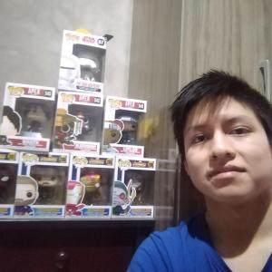
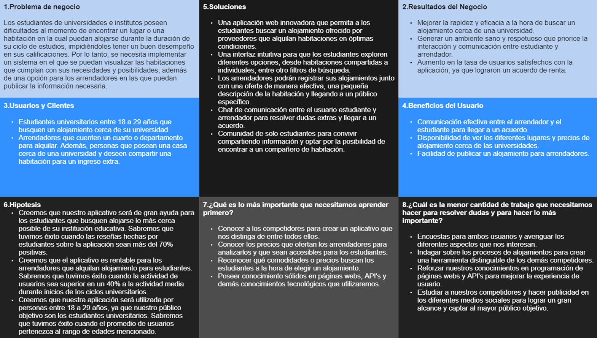

# Capítulo I: Introducción
## 1.1. StartUp Profile
### 1.1.1. Description de la StartUp

SoftWave Studio nació como una startup creada por un grupo de estudiantes universitarios especializados en Ingeniería de Software. Su principal propósito es desarrollar soluciones de software que aborden las necesidades y resuelvan los desafíos diarios a los que se enfrenta la gente en su rutina.

Como su primer proyecto, dieron vida a StudiStay, una plataforma diseñada para solucionar el problema de encontrar alojamiento para estudiantes universitarios e institucionales, a través de una innovadora aplicación web. Esta plataforma permite conectar a estudiantes en búsqueda de alojamiento con proveedores que ofrecen habitaciones adecuadas para sus necesidades.

La interfaz intuitiva de StudiStay posibilita a los estudiantes explorar una amplia gama de opciones, desde habitaciones individuales hasta apartamentos compartidos. Los proveedores de alojamiento pueden registrar sus ofertas de manera efectiva, alcanzando a su público objetivo de forma directa. Al actuar como mediadores entre la demanda y la oferta de alojamiento estudiantil, simplificamos el proceso y fomentamos la creación de comunidades sólidas entre los estudiantes. Estamos transformando por completo la experiencia de búsqueda de alojamiento, facilitando a los estudiantes encontrar su hogar ideal mientras persiguen sus metas académicas.

<b>Nuestra visión</b> consiste en liderar la redefinición de la experiencia de alojamiento estudiantil, estableciendo conexiones significativas y enriqueciendo la vida estudiantil mediante la aplicación de tecnología avanzada.

<b>Nuestra misión</b> se centra en simplificar la búsqueda y oferta de alojamiento para estudiantes, a través de una plataforma innovadora y amigable que promueva el crecimiento y el aprendizaje a través de la construcción de comunidades sólidas.

StudiStay no solo cambiará cómo los estudiantes encuentran alojamiento, sino que también transformará sus vidas al proporcionar un entorno en el que puedan crecer, aprender y construir conexiones significativas. Más que una solución tecnológica, estamos creando un espacio para que los sueños y objetivos de los estudiantes florezcan.

### 1.1.2. Perfiles de integrantes del equipo

<table align="center"  border="1" width="70%" style="text-align:center;">
    <tr align="center">
        <td rowspan="4">
            
        </td>
        <td align="left">
            <b>Nombre y Apellido:</b>
                         
            Alejo Cardenas, Luis Angel
        </td>
    </tr>
   <tr>
        <td align="left">
        <b>Codigo:</b>
         
        U202122519
        </td>
    </tr>
    <tr>
        <td align="left">
        <b>Descripción de carrera:</b>
         
        En Ingeniería de Software nos centramos en la programación, adaptabilidad, naturaleza dinámica y gestión de la calidad de un software existente o en la creación de un nuevo software, basándonos en técnicas y métodos proporcionados por la ingeniería. Además, brindamos mantenimiento y soporte operacional de software.
        </td>
    </tr>
    <tr>
        <td align="left">
        <b>Conocimiento y habilidades:</b>
         
       Tengo conocimientos en programación en C++ y Python. Además, soy bueno haciendo cálculos matemáticos, me comprometo a apoyar a mi equipo en todo lo posible y ser responsable con cada actividad que se me asigne.
        </td>
    </tr>
<td rowspan="4">
            
        </td>
        <td align="left">
            <b>Nombre y Apellido:</b>
                         
            Hurtado Palomino, Francisco Juan
        </td>
   <tr>
        <td align="left">
        <b>Codigo:</b>
         
        U202117498
        </td>
    </tr>
    <tr>
        <td align="left">
        <b>Descripción de carrera:</b>
         
        En Ingeniería de Software nos centramos en la programación, adaptabilidad, naturaleza dinámica y gestión de la calidad de un software existente o en la creación de un nuevo software, basándonos en técnicas y métodos proporcionados por la ingeniería. Además, brindamos mantenimiento y soporte operacional de software.
        </td>
    </tr>
    <tr>
        <td align="left">
        <b>Conocimiento y habilidades:</b>
         
Soy estudiante de Ingeniería de Software en la Universidad Peruana de Ciencias Aplicadas (UPC), con expectativa de graduarme en 2025. Mi experiencia se centra en el desarrollo web, con un sólido dominio de HTML, CSS, JavaScript y Vue.js. Además, tengo amplios conocimientos creación de contenido interactivo, incluyendo la edición de videos. Me apasiona combinar mis habilidades técnicas con enfoques creativos para desarrollar experiencias digitales atractivas.
       </td>
    </tr>
    <td rowspan="4">
            
        </td>
        <td align="left">
            <b>Nombre y Apellido:</b>
                         
            Ariana Huapaya Buitron
        </td>
   <tr>
        <td align="left">
        <b>Codigo:</b>
         
        U201819645
        </td>
    </tr>
    <tr>
        <td align="left">
        <b>Descripción de carrera:</b>
         
En Ingeniería de Software, nos enfocamos en la programación, la adaptabilidad y la naturaleza dinámica del software, ya sea en su desarrollo desde cero o en la mejora de uno existente. Aplicamos técnicas y métodos propios de la ingeniería para asegurar su calidad, así como para ofrecer mantenimiento y soporte operativo continuo.        </td>
    </tr>
    <tr>
        <td align="left">
        <b>Conocimiento y habilidades:</b>
         
descripcion de hablidades       </td>
    </tr>
<td rowspan="4">
            
        </td>
        <td align="left">
            <b>Nombre y Apellido:</b>
                         
            nombre, apellido
        </td>
   <tr>
        <td align="left">
        <b>Codigo:</b>
         
        codigo
        </td>
    </tr>
    <tr>
        <td align="left">
        <b>Descripción de carrera:</b>
         
descripcion de carrera        </td>
    </tr>
    <tr>
        <td align="left">
        <b>Conocimiento y habilidades:</b>
         
descripcion de hablidades       </td>
    </tr>
<td rowspan="4">
            
        </td>
        <td align="left">
            <b>Nombre y Apellido:</b>
                         
            nombre, apellido
        </td>
   <tr>
        <td align="left">
        <b>Codigo:</b>
         
        codigo
        </td>
    </tr>
    <tr>
        <td align="left">
        <b>Descripción de carrera:</b>
         
descripcion de carrera        </td>
    </tr>
    <tr>
        <td align="left">
        <b>Conocimiento y habilidades:</b>
         
descripcion de hablidades       </td>
    </tr>

</table>

## 1.2. Solution Profile
 
<b>Nombre del Producto:</b>

Nuestra aplicación web recibe el nombre de “StudiStay”, haciendo referencia tanto a uno de nuestros segmentos objetivos, los estudiantes, como a la posibilidad de poder encontrar un lugar cercano a sus centro educativos en el que puedan alojarse y quedarse durante todo el ciclo de estudios que poseen. Consideramos que esta representación es importante para poder llegar al público al que apuntamos.

 
<b>Descripción del Producto:</b>

Proponemos un servicio innovador y tecnológico, en el que se implementen todas las características necesarias para que los usuarios puedan concretar sus objetivos de manera eficiente y concreta. En nuestra aplicación, se podrán aplicar diversos filtros para que se pueda encontrar el lugar ideal, que corresponda con los requisitos y posibilidades de quien lo solicite.

 
<b>Monetización:</b> 

La aplicación generará ganancias por medio de publicidad mostrada en la plataforma, preferiblemente relacionada a nuestro tema tratado, por lo que el sitio será más vistoso y se podrá obtener ganancia del proyecto.

### 1.2.1. Antecedentes y problemática

* <b>Who</b>
   Nuestros usuarios son los estudiantes universitarios y de institutos que buscan una habitación que se encuentre cerca de su centro de estudios, en la cual puedan alojarse durante la duración de sus ciclos.  

* <b>What</b>
   El problema de nuestros usuarios es la falta de información acerca de habitaciones con las que puedan cumplir las condiciones, y que se encuentren cerca de su centro de estudios. Existe una gran cantidad de estudiantes que viven alejados de sus centros de estudio, los cuales se enfrentan diariamente a las largas distancias, debido al ineficiente sistema de transporte público.  

* <b>Where</b>
   El problema se encuentra en la poca información que se encuentran en los lugares cercanos a las instituciones, en la que la mayoría de opciones se encuentran fuera del alcance de nuestros usuarios.  

* <b>When</b>
   El problema suscitado se presenta cada vez que nuestros usuarios buscan información acerca de habitaciones que les puedan brindar beneficios para continuar con sus estudios.  

* <b>Why</b>
   Usualmente los usuarios no logran encontrar la información necesaria sobre las habitaciones, por lo que deben buscar por medio de internet, indagar con amigos o familia para encontrar lo más adecuado. Además, la distancia que existe entre la vivienda del estudiante y su centro de estudios es demasiada, haciendo uso del transporte público. Esta sentencia perjudica a los estudiantes en una ciudad como Lima, que en el 2018 fue considerada como una de las ciudades con el peor tráfico del mundo.  

* <b>How</b>
   La mayoría de veces resulta demasiado complicado el poder encontrar una habitación que coincida con las posibilidades de nuestros usuarios. Debido a esta problemática, surge nuestra aplicación, la cual servirá de apoyo a todos aquellos estudiantes, dentro de la cual podrán visualizar de forma ordenada las habitaciones de acuerdo a los filtros que apliquen.  

* <b>How much</b>
   Según el Instituto Nacional de Estadística e Informática en el año 2014, el 43% de estudiantes de universidades públicas eligió su centro de estudios debido a su prestigio, siendo solo el 8.4% por la cercanía a su domicilio. La problemática se origina debido a la escasa cantidad de información que podemos encontrar sobre habitaciones en las que los estudiantes puedan alojarse. Además que en internet, la información se encuentra de forma desordenada en las páginas web o aplicaciones, lo que genera fastidio y descontento en los usuarios.

### 1.2.2. Lean UX Process
#### 1.2.2.1. Lean UX Problem Statements
A los estudiantes de universidades e institutos se les presentan dificultades al momento de encontrar un lugar o una habitación en la cual puedan alojarse durante la duración de su ciclo de estudios, impidiéndoles tener un buen desempeño en sus calificaciones. Por lo tanto, se necesita implementar un sistema en el que se puedan visualizar las habitaciones que cumplan con sus necesidades y posibilidades, además de una opción para los arrendadores en las que puedan publicar la información necesaria. Como startup, solucionaremos la siguiente pregunta: ¿De qué manera se puede realizar una solución tecnológica y novedosa en la que se pueda recolectar esta información y facilite la elección de los estudiantes?

#### 1.2.2.2. Lean UX Assumptions
*   Business outcomes:
     
    <ol>
    <li>Los usuarios de la aplicación están interesados en buscar habitaciones según sus necesidades.</li>
    <li>Los usuarios confiarán en la seguridad y privacidad de la aplicación para administrar su información personal. </li>
    <li>Los usuarios aceptan proporcionar información detallada sobre su dirección, nombre real y foto en la aplicación. </li>
    <li>Los usuarios desean una interfaz de aplicación intuitiva, responsive y fácil de usar para la búsqueda y publicación de las habitaciones. </li>
    <li>Los usuarios buscan funciones adicionales, como que se incluya servicios de alimentación, seguridad y otros servicios de necesidad.  </li>
    <li>Los usuarios deben poder ver y analizar las opciones de renta de habitación de forma clara y precisa en la aplicación. </li>
    <li>Los usuarios esperan notificaciones y recordatorios para realizar un seguimiento del proceso de reserva o publicación en la aplicación. </li>
    <li>La aplicación debe ser compatible con múltiples navegadores modernos.</li>
    <li>Los usuarios están dispuestos a pagar por funciones premium o servicios adicionales en la aplicación.</li>
    </ol>

 

* User assumptions:  

    - <b>¿Quién es el usuario?</b>
       Los usuarios interesados en la aplicación son aquellos que buscan un lugar donde poder descansar o aquellos que viven lejos de la universidad y desean pasar la noche en un lugar cercano a la universidad sin tener que preocuparse por el largo trayecto a su casa el cual le facilita y ahorra tiempo para eventos importantes como un examen a primera hora. Además, de personas que tienen su casa cerca a la universidad y deseen compartir una habitación para obtener ingresos extra. Nuestros usuarios son: estudiantes de educación superior de entre 18 a 29 años y personas propietarias de casas o departamentos.  

    - <b>¿Dónde encaja nuestro producto en su trabajo o vida?</b>
       Nuestra aplicación es aplicable principalmente en los períodos académicos. Puesto que, en su gran mayoría los servicios tienen gran demanda cuando hay clases y/o exámenes.  

    - <b>¿Qué problema tiene nuestro producto? ¿Cómo se resuelve?</b>
       El problema que aborda nuestro producto es la dificultad de encontrar alojamiento conveniente y seguro para estudiantes durante períodos académicos. Se resuelve al proporcionar una plataforma que conecta estudiantes con habitaciones disponibles cercanas a instituciones educativas. Esto brinda a los estudiantes opciones asequibles y cómodas, y permite a los propietarios generar ingresos adicionales al alquilar sus habitaciones.  

    - <b>¿Cuándo y cómo es usado nuestro producto?</b>
       Nuestro producto se emplea en épocas académicas, cuando la demanda de alojamiento es alta. Los estudiantes encuentran habitaciones cercanas para descansar entre clases y estudiar, asegurando tranquilidad para los exámenes. Los propietarios publican habitaciones disponibles, generando ingresos extra. La app optimiza la experiencia de búsqueda y oferta de alojamiento, siendo eficaz y beneficiando a ambas partes.  

    - <b>¿Qué características son importantes?</b>
       La característica más importante son las sugerencias basadas en los intereses y cercanía del usuario, así como también el ofrecer otros servicios de gran importancia.  

    - <b>¿Cómo debe verse nuestro producto y comportarse?</b>
       Nuestro producto debe cumplir con su propósito sin falla alguna. El producto debe tener un uso intuitivo, ágil y eficiente.

#### 1.2.2.3. Lean UX Hypothesis Statements

- <b>Creemos que</b> nuestro aplicativo será de gran ayuda para los estudiantes que busquen alojarse lo más cerca posible de su institución educativa. <b>Sabremos que </b> tuvimos éxito <b>cuando</b> las reseñas hechas por estudiantes sobre la aplicación sean más del 70% positivas.

- <b>Creemos que</b> el aplicativo es rentable para los arrendadores que alquilan alojamiento para estudiantes. <b>Sabremos que</b> tuvimos éxito <b>cuando</b> la actividad de usuarios sea superior en un 40% a la actividad media durante inicios de los ciclos universitarios.

- <b>Creemos que</b> los estudiantes podrán encontrar alojamiento cerca de sus instituciones educativas. <b>Sabremos que</b>tuvimos éxito <b>cuando</b> más del 50% de usuarios lleguen a un acuerdo con los usuarios arrendadores.

- <b>Creemos que</b> nuestra aplicación será utilizada por personas entre 18 a 24 años, ya que nuestro público objetivo son los practicantes. <b>Sabremos que</b> tuvimos éxito <b>cuando</b> el 40% de usuarios pertenezca al rango de edades mencionado.

- <b>Creemos que</b> la notificación al recibir un mensaje de cómo va el acuerdo de alojamiento, será de gran utilidad para ambos usuarios. <b>Sabremos que</b> tuvimos éxito <b>cuando</b> los estudiantes y arrendadores califiquen 3 o más de 5 estrellas al chat de comunicación.

- <b>Creemos que</b> la aplicación será intuitiva y fácil de gestionar para ambos usuarios. <b>Sabremos que</b> tuvimos éxito <b>cuando</b> más del 60% de usuarios encuestados se sientan satisfechos con la interfaz de usuario.

#### 1.2.2.4. Lean UX Canvas

## 1.3. Segmentos Objetivo

 
<table align="center" border="1" width="70%" style="text-align:left;">
  <tr>
    <th style="text-align:center;">Tipo de Usuario</th>
    <td><b>Estudiantes que buscan información sobre habitaciones</b></td>
    <td><b>Arrendadores que buscan alquilar habitaciones</b></td>
  </tr>
  <tr>
    <th style="text-align:center;">Geográfico</th>
    <td><b>País:</b> Perú  <b>Zona residencial:</b> Actualmente se encuentran en zonas alejadas de sus centros educativos.</td>
    <td><b>País:</b> Perú  <b>Zona residencial:</b> Zonas urbanizadas y centralizadas.  </td>
  </tr>
  <tr>
    <th style="text-align:center;">Psicográfico</th>
    <td><b>Clase Social:</b> La mayoría de estos estudiantes se encuentran en una clase social media o media baja.  
    <b>Estilo de vida:</b> Son estudiantes comprometidos con sus estudios, a pesar de las adversidades que se les puedan presentar.</td>
    <td><b>Clase Social:</b> Abarcan clases sociales desde la clase media a la clase alta.  
    <b>Estilo de vida:</b> Deben ser personas que se comprometan a cumplir con brindar un buen espacio donde alojarse.</td>
  </tr>
  <tr>
    <th style="text-align:center;">Demográfico</th>
    <td><b>Edad:</b> Personas de edades entre 18 y 40 años.  
        <b>Nacionalidad:</b> Nacionalidad peruana. En el caso de ser extranjero, deberá identificarse con su pasaporte.  
        <b>Nivel de Ingreso:</b> No es relevante, ya que se pueden hacer comparaciones entre los lugares que se ofrecen.
    </td>
    <td><b>Edad:</b> Deben ser mayores de edad, preferiblemente mayores de 30 años.  
        <b>Nacionalidad:</b> Nacionalidad peruana. En el caso de ser extranjero, deberá identificarse con su pasaporte.  
        <b>Estudios:</b> Debe contar con secundaria completa o superior.  </td>
  </tr>
</table>
