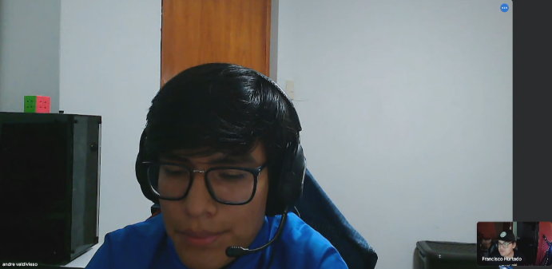
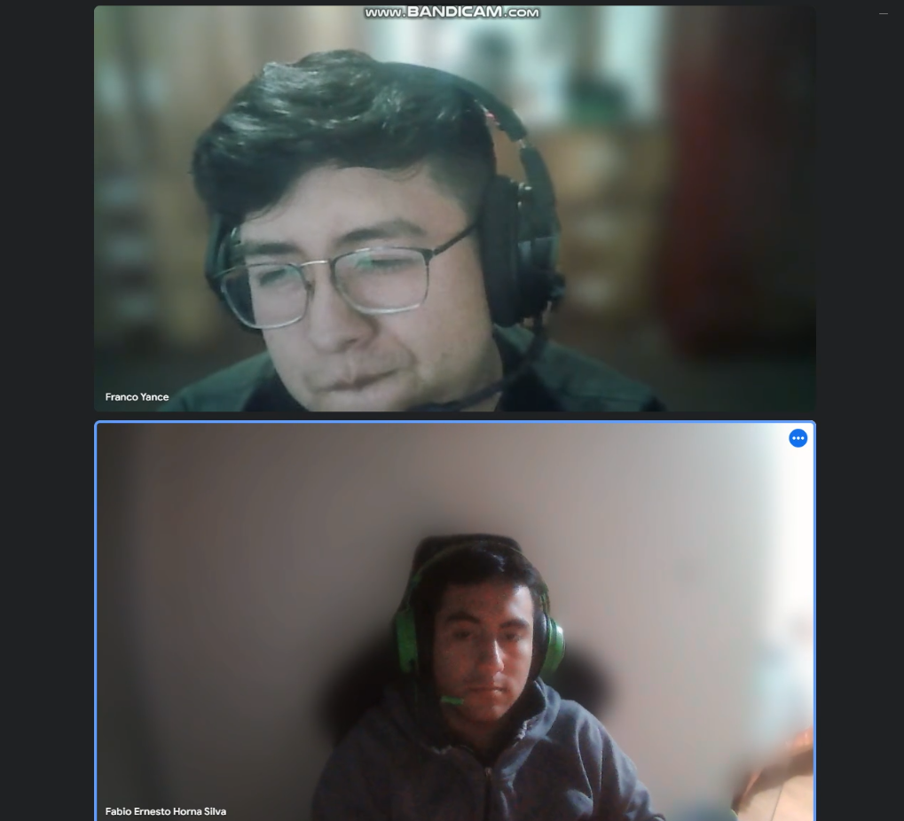
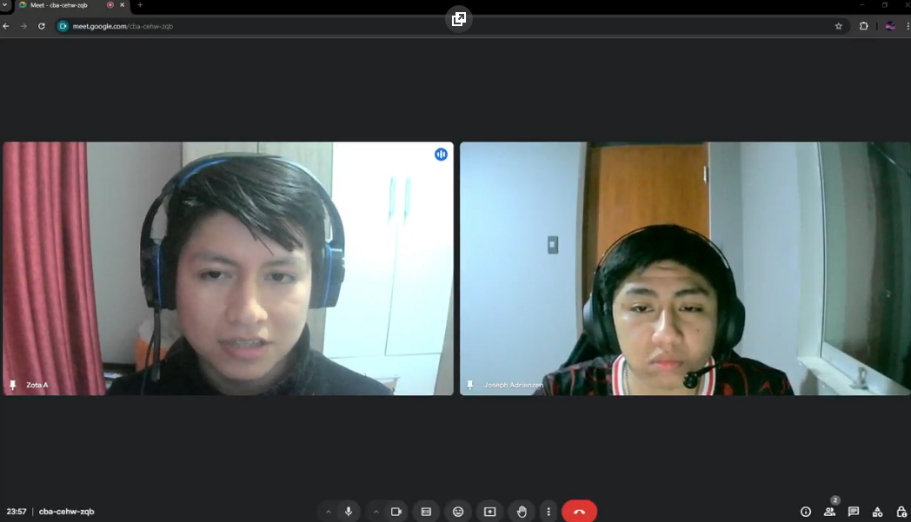
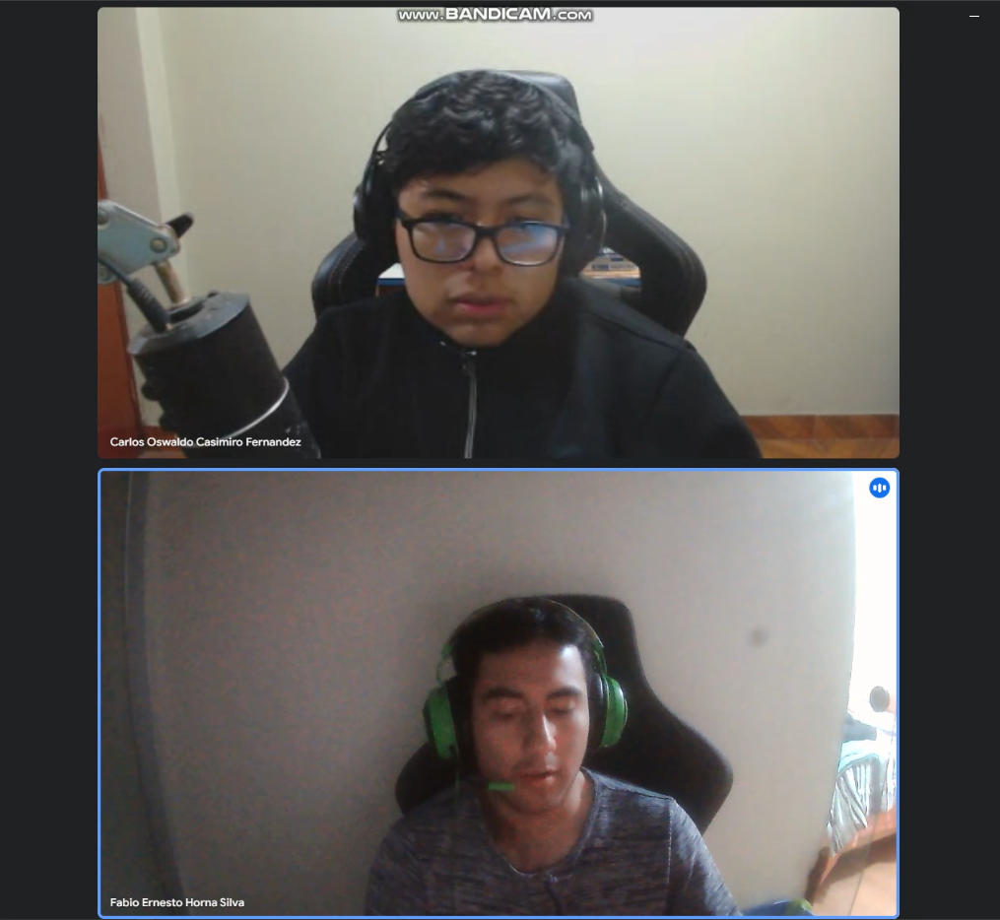
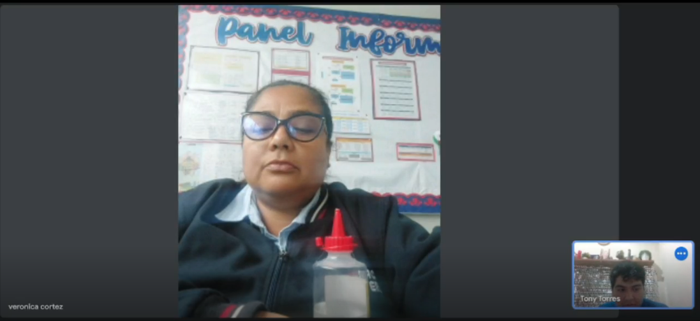
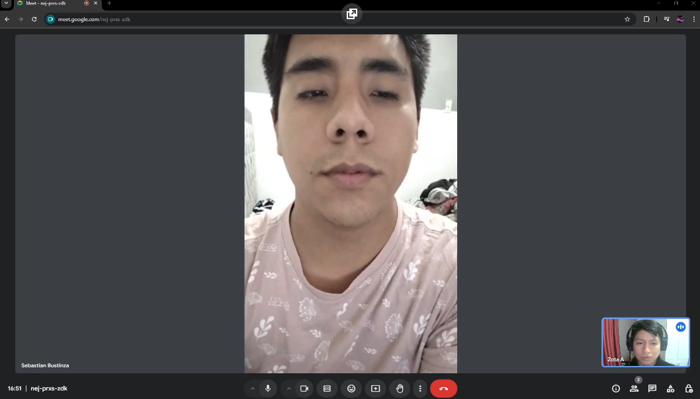
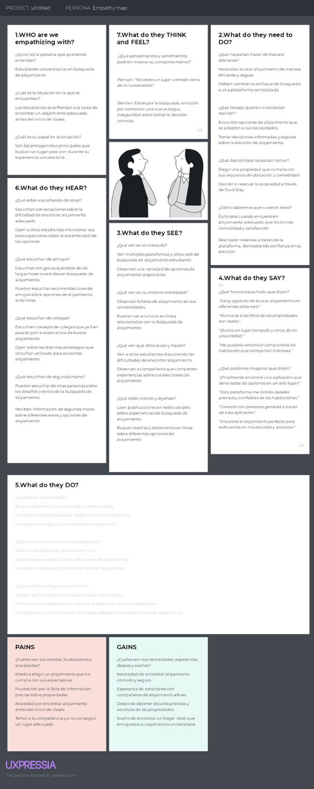
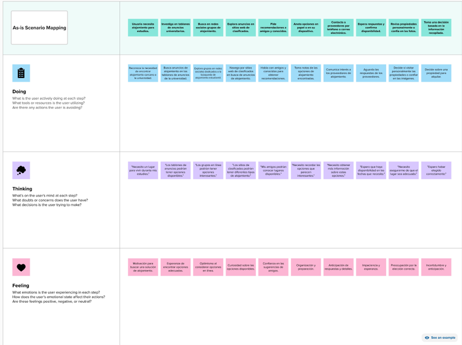

# Capítulo II: Requirements Elicitation & Analysis
## 2.1. Competidores

| Nombre del Competidor | Descripción |
|:----|:----:|
| Uniplaces (Web browser) https://www.uniplaces.com/es  | Uniplaces es una plataforma en línea que conecta a estudiantes y profesionales con alojamiento a corto y largo plazo en ciudades de todo el mundo. Ofrecen una amplia variedad de opciones de vivienda, desde habitaciones privadas hasta apartamentos completos, para satisfacer las necesidades de los usuarios. |
| HousingAnywhere (Web browser) https://housinganywhere.com/  | HousingAnywhere es una plataforma global de alquiler de viviendas que facilita la búsqueda y reserva de alojamiento amueblado en ciudades de todo el mundo. Conecta a inquilinos internacionales con propietarios locales y ofrece una amplia gama de opciones de vivienda temporal y a largo plazo. |
| Spotahome (Web Browser) https://www.spotahome.com/es | Spotahome es una plataforma en línea que se especializa en alquiler de viviendas a largo plazo. Ofrecen una selección de apartamentos y habitaciones verificadas que pueden ser alquilados sin necesidad de visitas previas, lo que hace que el proceso de alquiler sea más fácil y seguro. |

### 2.1.1. Análisis competitivo

<table>
  <tr>
    <th colspan="7" valign="top"><b>Competitive Analysis Landscape</b></th>
  </tr>
  <tr>
    <td colspan="2" rowspan="2">¿Por qué llevar a cabo este análisis?</td>
    <td colspan="5">Escriba en el recuadro la pregunta que busca responder o el objetivo de este análisis.</td>
  </tr>
  <tr>
    <td colspan="5">Este análisis se realizó con la finalidad de poder identificar a nuestros potenciales competidores e idear estrategias y tácticas para diferenciarnos de estos.</td>
  </tr>
  <tr>
    <td colspan="3">(En la cabecera colocar por cada competidor nombre y logo)</td>
    <td colspan="1" valign="top" style="font-weight: bold;">
        StudiStay
         
        

                
        

    <td colspan="1" valign="top" style="font-weight: bold;">
    Uniplaces
    

                
        

    </td>
    <td colspan="1" valign="top" style="font-weight: bold;">
      HousingAnywhere
      

                
            

      </td>
    <td colspan="1" valign="top" style="font-weight: bold;" >
      Spotahome
      

                
            

    </td>
  </tr>
  <tr>
    <td colspan="1" rowspan="2">
Perfil
</td>
    <td colspan="2">Overview</td>
    <td colspan="1" valign="top">StudiStay une estudiantes con alojamiento ideal. Plataforma web innovadora agiliza búsqueda y fomenta comunidad. Simplificamos vivienda estudiantil, promoviendo crecimiento y conexiones en entorno enfocado.</td>
    <td colspan="1" valign="top">Uniplaces es un portal en línea para la reserva de alojamiento universitario. Con oficina central en Lisboa, el portal fue fundado en 2012 por el portugués Miguel Amaro, el argentino Mariano Kostelec y el británico Ben Grech.</td>
    <td colspan="1" valign="top">Housing Anywhere es una plataforma en línea de alojamiento enfocada a estudiantes internacionales. La startup radicada en Róterdam fue fundada en 2009 por Niels van Deuren, en aquel tiempo estudiante en la Escuela de Administración de Róterdam de la Universidad Erasmo de Róterdam.
</td>
    <td colspan="1" valign="top">Spotahome es una plataforma en línea que ofrece alquiler de pisos y habitaciones de media y larga estancia en 29 ciudades de Europa y Asia.</td>
  </tr>
  <tr>
    <td colspan="2">Ventaja competitiva</td>
    <td colspan="1" valign="top">StudiStay destaca por su plataforma intuitiva, variedad de opciones de alojamiento y construcción de comunidades, brindando a los estudiantes comodidad, eficiencia y enriquecimiento en la búsqueda de alojamiento.</td>
    <td colspan="1" valign="top">Uniplaces ofrece alojamiento universitario diverso y seguro en línea. Búsqueda fácil, reserva conveniente, transparencia y asistencia multilingüe para estudiantes internacionales.</td>
    <td colspan="1" valign="top">Housing Anywhere ofrece a estudiantes internacionales alojamientos globales seguros y variados, con plataforma fácil, pagos seguros, interacción directa con arrendadores y apoyo multilingüe para una experiencia exitosa.</td>
    <td colspan="1" valign="top">Amplia cobertura, inspecciones virtuales, alquileres flexibles, seguridad, variedad, conveniencia. Adaptado para estancias prolongadas, brindando comodidad y confianza.
</td>
  </tr>
  <tr>
    <td colspan="1" rowspan="2">
Perfil de Marketing
</td>
    <td colspan="2">Mercado objetivo</td>
    <td colspan="1" valign="top">StudiStay abarca estudiantes universitarios y proveedores, simplificando la búsqueda de alojamiento con tecnología en diversas ubicaciones educativas, local e internacionalmente.
</td>
    <td colspan="1" valign="top">Estudiantes universitarios nacionales e internacionales buscando alojamiento cercano y adecuado en ciudades educativas en línea.
</td>
    <td colspan="1" valign="top">Estudiantes internacionales que necesitan alojamiento seguro y adaptable en múltiples destinos universitarios en todo el mundo.</td>
    <td colspan="1" valign="top">Estudiantes, jóvenes profesionales y viajeros que buscan alquileres de media y larga estancia en ciudades de Europa y Asia.</td>
  </tr>
  <tr>
    <td colspan="2">Estrategias de marketing</td>
    <td colspan="1" valign="top">Publicidad en redes sociales y motores de búsqueda. Colaboración con universidades para promocionar la plataforma. Testimonios y reseñas de usuarios para generar confianza. Campañas de lanzamiento con ofertas especiales. Marketing de contenido sobre vida estudiantil y alojamiento.
</td>
    <td colspan="1" valign="top">Publicidad en universidades: Colaboraciones con 
    instituciones educativas para promocionar servicios. Marketing en redes sociales: Campañas dirigidas a estudiantes en plataformas como Instagram y Facebook. Contenido informativo: Blog y videos con consejos para estudiantes sobre alojamiento y vida universitaria.
</td>
    <td colspan="1" valign="top">Asociaciones universitarias: Colaboraciones con universidades para promocionar la plataforma entre estudiantes. Influencers estudiantiles: Colaboración con estudiantes influyentes en redes sociales para aumentar la visibilidad. Campañas de marketing de contenidos: Creación de guías y recursos para estudiantes internacionales.
</td>
    <td colspan="1" valign="top">Anuncios geográficamente segmentados: Publicidad en línea dirigida a ciudades específicas donde opera. Experiencia virtual: Enfatizar inspecciones virtuales y recorridos 360° en el marketing. Programas de referidos: Recompensar a usuarios que recomienden la plataforma a otros inquilinos potenciales.
</td>
  </tr>
  <tr>
    <td colspan="1" rowspan="3">
Perfil de Producto
</td>
    <td colspan="2">Productos & Servicios</td>
    <td colspan="1" valign="top">Plataforma alojamiento estudiantil. Opciones variadas, comunicación directa, información detallada, construcción de comunidades y experiencias enriquecedoras.</td>
    <td colspan="1" valign="top">Reserva de habitaciones y apartamentos universitarios en línea. Opciones de alojamiento diversificadas y adaptadas a las necesidades estudiantiles. Garantía de devolución de dinero en caso de discrepancias.
</td>
    <td colspan="1" valign="top">Plataforma de búsqueda y reserva de alojamiento a largo plazo. Inspecciones virtuales y fotos detalladas de propiedades. Seguridad en los pagos y verificación de propiedades.
</td>
    <td colspan="1" valign="top">Alquiler de pisos y habitaciones de media y larga estancia. Recorridos virtuales y descripciones exhaustivas de propiedades. Flexibilidad y adaptabilidad para estudiantes y profesionales.
</td>
  </tr>
  <tr>
    <td colspan="2">Precios y Costos</td>
    <td colspan="1" valign="top">Precios: Registro gratuito. Publicación de propiedades desde 10€. Comisión por reserva del 5% para proveedores. Costos: Desarrollo, marketing, soporte.
</td>
    <td colspan="1" valign="top">Precio de Reserva: Desde 50€ hasta 300€, según la ubicación y tipo de alojamiento. Comisión de Servicio: 5% del precio de reserva. Costos de Operación: Marketing (15,000€/mes), Soporte al Cliente (10,000€/mes), Desarrollo de Plataforma (20,000€/mes).</td>
    <td colspan="1" valign="top">Precio de Reserva: Varía según la duración y ubicación, desde 300€ al mes. Comisión de Plataforma: 10% del precio de reserva. Costos de Operación: Marketing (18,000€/mes), Seguridad en Pagos (8,000€/mes), Desarrollo de Tecnología (25,000€/mes).
</td>
    <td colspan="1" valign="top">Precio de Alquiler: Desde 500€ al mes para habitaciones y 1,000€ al mes para apartamentos. Comisión de Intermediación: 8% del primer mes de alquiler. Costos de Operación: Marketing (12,000€/mes), Inspecciones Virtuales (5,000€/mes), Equipo de Soporte (15,000€/mes).
</td>
  </tr>
  <tr>
    <td colspan="2">Canales de distribución</td>
    <td colspan="1" valign="top">Plataforma web accesible desde navegadores. Colaboración con instituciones educativas para promoción. Marketing en redes sociales y anuncios en línea.
</td>
    <td colspan="1" valign="top">Sitio web oficial: Plataforma en línea donde los estudiantes pueden buscar, ver y reservar alojamiento directamente. Colaboraciones universitarias: Asociaciones con universidades para promocionar el servicio entre los estudiantes. Marketing en redes sociales: Campañas en plataformas como Instagram y Facebook para llegar a su público objetivo. Afiliados y socios: Colaboración con agentes inmobiliarios y sitios web relacionados para ampliar la visibilidad.
</td>
    <td colspan="1" valign="top">Plataforma en línea: Sitio web donde los estudiantes pueden explorar opciones y realizar reservas. Colaboración universitaria: Asociaciones con instituciones educativas para promover la plataforma entre estudiantes internacionales. Programas de recomendación: Usuarios existentes pueden referir la plataforma a otros estudiantes. Publicidad en línea: Anuncios en redes sociales y motores de búsqueda para llegar a estudiantes potenciales.
</td>
    <td colspan="1" valign="top">Plataforma en línea: Sitio web donde los usuarios pueden buscar y reservar alojamiento a largo plazo. Marketing geográfico: Publicidad en línea específicamente dirigida a ciudades donde opera. Colaboraciones con intermediarios: Asociaciones con agencias inmobiliarias locales para ampliar la oferta de alojamiento. Estrategia de contenidos: Blogs, videos y recursos informativos para atraer tráfico y promocionar la plataforma.
</td>
  </tr>
  <tr>
    <td colspan="1" rowspan="5">
Análisis SWOT
</td>

  </tr>
  <tr>
    <td colspan="2">Fortalezas</td>
    <td colspan="1" valign="top">Equipo fundador especializado en Ingeniería de Software. Soluciones tecnológicas innovadoras para problemas diarios. Plataforma StudiStay: Interfaz intuitiva y amplia gama de opciones. Enfoque en conectar estudiantes y proveedores de alojamiento.
</td>
    <td colspan="1" valign="top">Amplia variedad de opciones de alojamiento. Plataforma intuitiva y fácil de usar. Garantía de devolución de dinero para seguridad del cliente.
</td>
    <td colspan="1" valign="top">Cobertura global en múltiples destinos universitarios. Inspecciones virtuales para comodidad de los usuarios. Relaciones con universidades para promoción.
</td>
    <td colspan="1" valign="top">Enfoque en alquileres de media y larga estancia. Ofrece inspecciones virtuales y detalles de propiedades. Adaptabilidad a diferentes necesidades de alojamiento.
</td>
  </tr>
  <tr>
    <td colspan="2">Debilidades</td>
    <td colspan="1" valign="top">Falta de reconocimiento de marca en el mercado. Dependencia de la aceptación de la plataforma por parte de los estudiantes y proveedores.
</td>
    <td colspan="1" valign="top">Competencia en el mercado de alojamiento estudiantil en línea. Dependencia de la reputación y confianza del sitio web.
</td>
    <td colspan="1" valign="top">Necesidad de mantener una plataforma tecnológicamente avanzada. Competencia en el espacio de alojamiento para estudiantes.
</td>
    <td colspan="1" valign="top">Posible desafío para mantener la calidad de las inspecciones virtuales. Dependencia de la reputación y confianza en la plataforma.
</td>
  </tr>
  <tr>
    <td colspan="2">Oportunidades</td>
    <td colspan="1" valign="top">Alta demanda de soluciones tecnológicas en el sector de alojamiento estudiantil. Posibilidad de expandirse a otras soluciones relacionadas con la vida estudiantil. Crear una comunidad sólida entre estudiantes y proveedores.
</td>
    <td colspan="1" valign="top">Creciente demanda de alojamiento para estudiantes internacionales. Posibilidad de expansión a más ubicaciones universitarias.
</td>
    <td colspan="1" valign="top">Crecimiento del número de estudiantes internacionales. Expansión a nuevas ciudades y regiones.
</td>
    <td colspan="1" valign="top">Mayor demanda de alojamiento a largo plazo. Colaboraciones con intermediarios inmobiliarios.
</td>
  </tr>
  <tr>
    <td colspan="2">Amenazas</td>
    <td colspan="1" valign="top">Competencia de otras plataformas de búsqueda de alojamiento. Cambios en las preferencias de los estudiantes en cuanto a alojamiento. Riesgo de problemas técnicos o fallas en la plataforma.
</td>
    <td colspan="1" valign="top">Posible cambio en las preferencias de alojamiento de los estudiantes. Posible entrada de nuevos competidores en el mercado.
</td>
    <td colspan="1" valign="top">Cambios en las políticas de inmigración que afecten a la demanda. Posible aumento de la competencia de otras plataformas.
</td>
    <td colspan="1" valign="top">Competencia en el mercado de alquileres a largo plazo. Cambios en las preferencias de alojamiento de los estudiantes y profesionales.
</td>
  </tr>
</table>

### 2.1.2. Estrategias y tácticas frente a competidores

- Desarrollaremos nuestra aplicación y/o página web en la que minimizamos los posibles errores que se presenten, así los usuarios puedan tener una mejor experiencia de uso.

- Brindaremos un buen medio de comunicación entre los estudiantes y los arrendadores.

- Realizaremos encuestas a nuestros usuarios para conocer las características específicas que podemos mejorar.

- Pondremos en práctica un estudio de los competidores para evitar cometer sus errores.

- Recopilaremos información a través de revisiones de reseñas y comentarios de las características de nuestros competidores.

## 2.2. Entrevistas
### 2.2.1. Diseño de entrevistas

**Preguntas generales:**

- ¿Cómo te llamas?
- ¿Cuántos años tienes?
- ¿Lugar de residencia?
- ¿A qué te dedicas actualmente?

**Preguntas sobre personalidad**

- ¿Te consideras una persona extrovertida o introvertida? ¿Por qué?

**Segmento 1: Estudiantes que buscan información sobre habitaciones:**

- Actualmente, ¿qué tipo de lugar o habitación está buscando?
- ¿Qué características considera que debe poseer un sitio ideal en el que pueda alojarse?
- ¿Cuáles son los principales inconvenientes que se le presentan para poder encontrar una habitación cercana a su institución educativa?
- ¿Qué beneficios podría obtener al conseguir un lugar con las características que menciona?
- ¿Te sería de utilidad una aplicación en la que puedas encontrar este tipo de información?
- ¿Qué facilidades debería tener una aplicación que brinde información sobre habitaciones para estudiantes?

**Segmento 2: Arrendadores que buscan alquilar habitaciones**

- Actualmente, ¿qué tipo de lugar o habitaciones ofrece al público, en especial a los estudiantes?
- ¿Qué características considera que debe poseer un sitio ideal en el que pueda alojarse?
- ¿Cuáles son los principales inconvenientes que se le presentan al momento de concretar los alquileres de las habitaciones?
- ¿Qué beneficios podría obtener al concretar los alquileres de manera más eficiente?
- ¿Te sería de utilidad una aplicación en la que puedas ofrecer las habitaciones que dispones?
- ¿Qué facilidades debería tener una aplicación en la que puedas conectarte con los estudiantes que necesitan una habitación para alojarse?

**Para mejorar la aplicación**
- ¿Qué te parece la idea de nuestro proyecto? ¿Te sería útil?
- ¿Tienes sugerencias sobre posibles mejoras o características adicionales que podríamos integrar en nuestra aplicación?

### 2.2.2. Registro de entrevistas

**Segmento 1: Estudiantes que buscan información sobre habitaciones.**

**Entrevistado 1**

Nombres: Andre Marcelo

Apellidos: Valdivieso Sanchez

Edad: 18

Distrito: Chorrillos

Enlace de la entrevista:  [Entrevista Andre](https://upcedupe-my.sharepoint.com/:v:/g/personal/u202117498_upc_edu_pe/Eb_12oTnqKxMpndJEoZX_uIBJKGOeyw0EBlGxsppxkv75A?nav=eyJyZWZlcnJhbEluZm8iOnsicmVmZXJyYWxBcHAiOiJPbmVEcml2ZUZvckJ1c2luZXNzIiwicmVmZXJyYWxBcHBQbGF0Zm9ybSI6IldlYiIsInJlZmVycmFsTW9kZSI6InZpZXciLCJyZWZlcnJhbFZpZXciOiJNeUZpbGVzTGlua0NvcHkifX0&e=cblsbh)

Resumen de la entrevista: 

Andre nos cuenta que es un estudiante que vive bastante alejado de su universidad, nos comenta que se sentiria muy comodo estando en un departamento pequeño o un cuarto con salida directa a la calle especificamente, nos comenta que el hecho de vivir en lugares con habitaciones dentro de casas le puede llegar a parecer incomodo.

**Entrevistado 2**

Nombres:Franco Felix 

Apellidos: Yance Gutierrez

Edad: 22

Distrito: Ancon

Enlace de la entrevista: [Entrevista Franco](https://www.youtube.com/watch?v=7aXvhhLLTL4)

Resumen de la entrevista:

Franco Yance, un estudiante de 24 años, menciona que está buscando un lugar para vivir cerca de su universidad en San Miguel, y señala que para él es importante encontrar un sitio con un precio accesible, sin mucho ruido y con buena iluminación para poder estudiar. Ha utilizado aplicaciones de alquiler anteriormente, pero solo para hoteles, y considera interesante una app exclusiva para estudiantes. Recomienda que dicha aplicación ofrezca opciones de pago diversas, como tarjetas y billeteras digitales, un sistema de recomendaciones, y una galería de imágenes de las propiedades. Finalmente, afirma que estaría dispuesto a usar una app de ese tipo.

**Entrevistado 3**

Nombres: Joseph Lewin

Apellidos: Adrianzen Bayona

Edad: 24 años

Distrito: San Martin de Porres

Enlace de la entrevista: [Entrevista Joseph](https://upcedupe-my.sharepoint.com/:v:/g/personal/u202117498_upc_edu_pe/EcKdtnt69FBDvVp3QQEiDX4BN-5pwGuTNCv_P23aRjg-Hw?nav=eyJyZWZlcnJhbEluZm8iOnsicmVmZXJyYWxBcHAiOiJPbmVEcml2ZUZvckJ1c2luZXNzIiwicmVmZXJyYWxBcHBQbGF0Zm9ybSI6IldlYiIsInJlZmVycmFsTW9kZSI6InZpZXciLCJyZWZlcnJhbFZpZXciOiJNeUZpbGVzTGlua0NvcHkifX0&e=J2bi3l)

Resumen de la entrevista:
La entrevista con Joseph proporcionó información valiosa sobre los desafíos que enfrentan los estudiantes a la hora de buscar una habitación cerca de su universidad. Uno de los desafíos principales son los precios de alquiler, la poca disponibilidad de los arrendadores para concretar los contratos de manera rápida y segura. Además, está interesado en lugares que ofrezcan buenos servicios como internet, supermercados y centros de salud cercanos. Joseph expresó interés en una aplicación web que proporcione seguridad y confianza a la hora de querer alquilar una habitación, sus principales dudas serían el tamaño de la habitación, los servicios básicos ofrecidos y un centro de salud cercano,

**Segmento 2: Arrendadores**

**Entrevistado 1**

Nombres: Carlos Oswaldo

Apellidos: Cassimiro Fernandez

Edad: 21

Distrito: Santa Anita

Enlace de la entrevista: [Ver video de YouTube](https://youtu.be/wn3yyVRTOjU)

Resumen de la entrevista: 

En la entrevista, Carlos Osvaldo Casemiro Fernández, un joven de 21 años que vive en Santa Anita y trabaja en una inmobiliaria mientras estudia, habla sobre su experiencia en el alquiler de habitaciones para estudiantes. Explica que los lugares que ofrece suelen estar ubicados cerca de instituciones educativas para reducir el tiempo de desplazamiento. Carlos menciona que uno de los principales inconvenientes en el alquiler es la desconfianza hacia los inquilinos y la preocupación sobre la puntualidad en los pagos. También resalta los beneficios de un proceso de alquiler eficiente, como la mejora en la confianza y en el trato con los inquilinos. Considera que una aplicación podría ser muy útil para facilitar el alquiler de habitaciones, sugiriendo que debería incluir herramientas para ubicar propiedades, interactuar con los inquilinos y tener un soporte eficiente.

**Entrevistado 2**

Nombres: Veronica

Apellidos: Cortez Nonajulca 

Edad: 43

Distrito: Callao

Enlace de la entrevista: [Entrevista Veronica](https://upcedupe-my.sharepoint.com/:v:/g/personal/u202117498_upc_edu_pe/EZnTn9x3qe1FpWkDJHRGrDEB8Y07tnCS1HTnkOc_lhiHQQ?nav=eyJyZWZlcnJhbEluZm8iOnsicmVmZXJyYWxBcHAiOiJPbmVEcml2ZUZvckJ1c2luZXNzIiwicmVmZXJyYWxBcHBQbGF0Zm9ybSI6IldlYiIsInJlZmVycmFsTW9kZSI6InZpZXciLCJyZWZlcnJhbFZpZXciOiJNeUZpbGVzTGlua0NvcHkifX0&e=okj13r)

Resumen de la entrevista:
En la entrevista, Veronica Cortez Nonajulca, una señora de 43 años que reside en el Callao nos comenta que ademas de ser coordinadora academica arrenda habitaciones a estudiantes universitarios, nos comenta que la comodidad y el espacio son su mayor prioridad al ofrecer una habitacion a sus clientes. Uno de las problematicas que nos menciona es la garantía debido a diferentes factores que pueden afectarla o comprometerla de manera economica. Resalta que una aplicación que asista en sus servicios sería de gran utilidad, ya que la innovación tecnológica permite mostrar en tiempo real características y actualizaciones, lo que resulta en una experiencia de usuario mejorada.

**Entrevistado 3**

Nombres: Sebastian

Apellidos: Bustinza

Edad: 22 años

Distrito: Los Olivos

Enlace de la entrevista: [Entrevista Sebastian](https://upcedupe-my.sharepoint.com/:v:/g/personal/u202117498_upc_edu_pe/EeEieb0h1etBulqf0C27cw4BGOPr90zuhVxtBp44BjGe1A?nav=eyJyZWZlcnJhbEluZm8iOnsicmVmZXJyYWxBcHAiOiJPbmVEcml2ZUZvckJ1c2luZXNzIiwicmVmZXJyYWxBcHBQbGF0Zm9ybSI6IldlYiIsInJlZmVycmFsTW9kZSI6InZpZXciLCJyZWZlcnJhbFZpZXciOiJNeUZpbGVzTGlua0NvcHkifX0&e=U4Epsj)

Resumen de la entrevista:

La entrevista a Sebastian nos proporcionó información relevante sobre cuáles son las dificultades y obstáculos que se les presentan a los arrendadores a la hora del pago puntual y una manera de gestionar todas sus habitaciones.A su vez se preocupa por las comodidades que le ofrece a los estudiantes por ejemplo, electricida, agua, cocina, un lugar donde pueda hacer sus necesidades básicas y se encuentre cerca de su lugar de estudio. Nos comenta que en una aplicación le gustaría tener un medio de comunicación con sus clientes, además de agregar un apartado de comentarios para que otros clientes se interesen en sus habitaciones.

****

### 2.2.3. Análisis de entrevistas

Este análisis se enfoca en dos grupos clave: estudiantes universitarios en busca de habitaciones y propietarios interesados en alquilar a estudiantes. Mediante entrevistas con representantes de ambos segmentos, se identifican sus necesidades y preferencias, lo que permite crear perfiles de usuario y diseñar una aplicación eficiente para la búsqueda de habitaciones.

**Segmento 1: Estudiantes en busca de habitaciones**

Los estudiantes universitarios de este grupo priorizan la cercanía a su centro de estudios, las comodidades básicas y la seguridad al buscar alojamiento. Ven con buenos ojos una aplicación que facilite este proceso, confiando en las opiniones de otros usuarios. Estas características son esenciales para el diseño de una plataforma efectiva.

**Características Objetivas:**

- Proximidad a la universidad: El 100% de los estudiantes prefiere alojamientos cercanos a su universidad, siendo este un factor decisivo.
- Comodidades básicas: El 67% de los estudiantes busca habitaciones con comodidades como cama y baño privado.
- Dificultades en la búsqueda: El 100% de los estudiantes experimenta dificultades para encontrar alojamiento, lo que subraya la necesidad de una solución eficiente.
- Interés en aplicaciones: El 67% está interesado en usar una aplicación para buscar alojamiento.
- Ahorro de tiempo y dinero: El 67% prioriza el ahorro de tiempo y dinero al buscar alojamiento.
- Seguridad: El 100% valora la seguridad como un factor crucial.
- Confiabilidad de la información: El 100% considera esencial contar con reseñas verificadas y datos confiables.

**Características Subjetivas:**

- Preferencia por introversión/extroversión: La app debe ajustar las opciones de comunicación según las preferencias de los usuarios.
- Equilibrio entre costo y comodidad: La aplicación debe ofrecer herramientas para comparar opciones en base a seguridad y costos.
- Importancia de la confianza: Incluir calificaciones y reseñas verificadas para fortalecer la confianza entre usuarios.
- Personalización: Algoritmos de recomendación que consideren las preferencias individuales, como cercanía y comodidades.

**Segmento 2: Propietarios que alquilan a estudiantes**

Se realizaron entrevistas con propietarios interesados en alquilar a estudiantes, revelando sus motivaciones y necesidades. Estas características son clave para diseñar una aplicación que beneficie tanto a arrendadores como a estudiantes.

**Características Objetivas:**

- Tipo de habitación: Los propietarios buscan ofrecer habitaciones con comodidades básicas como cama y baño.
- Ubicación preferida: Algunos priorizan zonas seguras.
- Problemas de comunicación: Algunos arrendadores enfrentan dificultades al comunicarse con los inquilinos.
- Espacios comunes: Algunos ofrecen espacios adicionales o comodidades para atraer a los estudiantes.

**Características Subjetivas:**

- Experiencia y motivación: La experiencia en negocios en línea y la motivación para alquilar pueden mejorar la interacción en la plataforma.
- Compromiso con los estudiantes: El interés de los arrendadores por mejorar la experiencia de los estudiantes puede fomentar una mayor colaboración.
- Importancia de la comunicación: La comunicación efectiva influye en el éxito de las relaciones dentro de la app.
- Servicios adicionales: Arrendadores que ofrezcan servicios extra pueden promocionarlos eficientemente a través de la aplicación.

## 2.3. Needfinding
### 2.3.1. User Personas

**Segmento 1: Estudiantes que buscan información sobre habitaciones**

**Segmento 2: Arrendadores que buscan alquilar habitaciones**

### 2.3.2. User Task Matrix

**Segmento Objetivo: Estudiantes que buscan información sobre habitaciones**

| Tarea | Frecuencia | Severidad | 
|:----|:----:|:----|
| Reunir información sobre la seguridad de la zona de alojamiento | Casi siempre | Alta |
| Comparar precios entre diferentes habitaciones | A veces | Media |
| Contactarse con los arrendadores | A veces | Media |
| Evaluar las características de las habitaciones | Casi siempre | Alta |
| Investigar habitaciones cerca de su institución educativa | Siempre | Alta |
| Evaluar las comodidades que brinda el arrendador | A veces | Media |

**Segmento Objetivo: Arrendadores que buscan alquilar habitaciones**

| Tarea | Frecuencia | Severidad | 
|:----|:----:|:----|
| Gestionar las propiedades que posee | Siempre | Alta |
| Contactarse con los posibles clientes | A veces | Alta |
| Evaluar los beneficios del contrato | Casi siempre | Media |
| Adquirir información sobre propiedades | Casi siempre | Media |
| Diseñar publicidad de las habitaciones | A veces | Media |
| Buscar medios dónde publicitar sus habitaciones | Casi siempre | Media |

### 2.3.3. User Journey Mapping

**Segmento Objetivo: Estudiantes que buscan información sobre habitaciones**

**Segmento Objetivo: Arrendadores que buscan alquilar habitaciones**

### 2.3.4. Empathy Mapping

### 2.3.5. As-is Scenario Mapping

 
