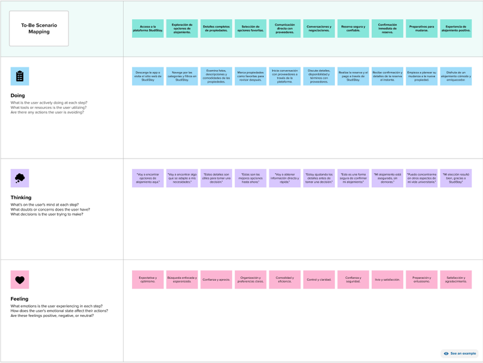
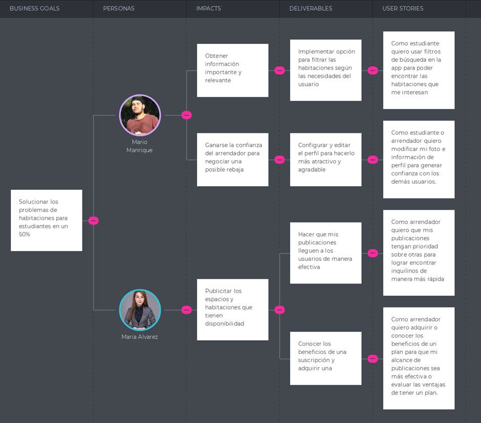

# Capítulo III: Requirements Specification
## 3.1. To-Be Scenario Mapping

    

## 3.2. User Stories

<table border="1" width="70%" style="text-align:center;">
    <thead>
        <tr style="background-color: #a4c2f4;">
            <th><b>EpicID</b></th>
            <th><b>Epic</b></th>
            <th><b>UserStoryID</b></th>
            <th><b>User stories</b></th>
        </tr>
    </thead>
    <tbody style="text-align:left;">
        <tr>
            <td rowspan="4">E01</td>
            <td rowspan="4"><b>Registro de cuentas Como</b> usuario <b>quiero</b> registrarme, iniciar               sesión y tener control de mi cuenta <b>para</b> hacer uso de la aplicación.</td>
            <td style="background-color: #fce5cd;">US01</td>
            <td>Registrarme</td>
        </tr>
        <tr>
            <td style="background-color: #fce5cd;">US02</td>
            <td>Iniciar sesión</td>
        </tr>
        <tr>
            <td style="background-color: #fce5cd;">US03</td>
            <td>Recuperar contraseña</td>
        </tr>
        <tr>
            <td style="background-color: #fce5cd;">US04</td>
            <td>Salir de la cuenta</td>
        </tr>
    </tbody>
    <tbody style="text-align:left;">
        <tr>
            <td rowspan="4">E02</td>
            <td rowspan="4"><b>Configuración de cuenta Como</b> usuario <b>quiero</b> configurar mi                  cuenta a mis gustos <b>para</b> sentirme cómodo con la aplicación.</td>
            <td style="background-color: #fce5cd;">US05</td>
            <td>Configurar las notificaciones</td>
        </tr>
        <tr>
            <td style="background-color: #fce5cd;">US06</td>
            <td>Cambiar mi contraseña</td>
        </tr>
        <tr>
            <td style="background-color: #fce5cd;">US07</td>
            <td>Editar mi perfil</td>
        </tr>
        <tr>
            <td style="background-color: #fce5cd;">US08</td>
            <td>Ayuda y consejos</td>
        </tr>
    </tbody>
    <tbody style="text-align:left;">
        <tr>
            <td rowspan="4">E03</td>
            <td rowspan="4"><b>Funciones de arrendador Como</b> arrendador <b>quiero</b> crear, visualizar, editar y borrar publicaciones <b>para</b> gestionar todas mis habitaciones que alquilo.</td>
            <td style="background-color: #fce5cd;">US09</td>
            <td>Crear publicación</td>
        </tr>
        <tr>
            <td style="background-color: #fce5cd;">US10</td>
            <td>Visualizar publicación</td>
        </tr>
        <tr>
            <td style="background-color: #fce5cd;">US11</td>
            <td>Editar una publicación</td>
        </tr>
        <tr>
            <td style="background-color: #fce5cd;">US12</td>
            <td>Borrar una publicación</td>
        </tr>
    </tbody>
    <tbody style="text-align:left;">
        <tr>
            <td rowspan="4">E04</td>
            <td rowspan="4"><b>Funciones de estudiante Como</b> estudiante <b>quiero</b> visualizar habitaciones cerca de mi universidad y chatear con el propietario <b>para</b> facilitar el proceso de búsqueda de habitaciones.</td>
            <td style="background-color: #fce5cd;">US13</td>
            <td>Visualización de la vista Publicaciones, Universidades y Perfil</td>
        </tr>
        <tr>
            <td style="background-color: #fce5cd;">US14</td>
            <td>Filtro de búsqueda</td>
        </tr>
        <tr>
            <td style="background-color: #fce5cd;">US15</td>
            <td>Colocar reseña y puntuar habitación</td>
        </tr>
        <tr>
            <td style="background-color: #fce5cd;">US16</td>
            <td>Editar o borrar reseña</td>
        </tr>
    </tbody>
    <tbody style="text-align:left;">
        <tr>
            <td rowspan="4">E05</td>
            <td rowspan="4"><b>Funciones de pago Como</b> estudiante <b>quiero</b> reservar y realizar mis pagos de manera virtual <b>para</b> efectuar los pagos de mis reservas.</td>
            <td style="background-color: #fce5cd;">US17</td>
            <td>Reservar una habitación</td>
        </tr>
        <tr>
            <td style="background-color: #fce5cd;">US18</td>
            <td>Añadir método de pago</td>
        </tr>
        <tr>
            <td style="background-color: #fce5cd;">US19</td>
            <td>Modificar método de pago</td>
        </tr>
        <tr>
            <td style="background-color: #fce5cd;">US20</td>
            <td>Eliminar método de pago</td>
        </tr>
    </tbody>
</table>
 
<table align="center"  border="1" width="70%" style="text-align:center;">
    <tbody >
        <tr>
            <td style="background-color: #ccc;">HU:</td>
            <td>US01 </td>
            <td style="background-color: #ccc;">Título:</td>
            <td style="text-align:left;">Registrarme</td>
        </tr>
        <tr>
            <td style="background-color: #ccc;">Usuario:</td>
            <td colspan="3" style="text-align:left;">Estudiante - Arrendador</td>
        </tr>
        <tr>
            <td style="background-color: #ccc;">Descripción</td>
            <td colspan="3" style="text-align:left;"><b>Como</b> estudiante o arrendador <b>quiero</b> registrarme <b>para</b> hacer uso de la aplicación.</td>
        </tr>
        <tr>
            <td style="background-color: #ccc;">Criterios de aceptación</td>
            <td colspan="3" style="text-align:left;"><b><em>Escenario 1: Registrarse como estudiante</em> Dado</b> que el usuario estudiante ingresa por primera vez a la aplicación <b>Y</b> quiere registrarse para hacer uso de la aplicación, <b>Cuando</b> rellene con sus datos personales los campos obligatorios <b>Y</b> de click al botón “Registrar” <b>Entonces</b> el usuario estudiante será registrado <b>Y</b> podrá acceder a todas las secciones y funciones de un estudiante en la app.  <b><em>Escenario 2: Registrarse como arrendador</em> Dado</b> que el usuario arrendador ingresa por primera vez a la aplicación <b>Y</b> quiere registrarse para hacer uso de la aplicación, <b>Cuando</b> rellene con sus datos personales los campos obligatorios <b>Y</b> de click al botón “Registrar” <b>Entonces</b> el usuario arrendador será registrado <b>Y</b> podrá acceder a todas las secciones y funciones de un arrendador en la app.</td>
        </tr>
    </tbody>
</table>
 
<table align="center"  border="1" width="70%" style="text-align:center;">
    <tbody >
        <tr>
            <td style="background-color: #ccc;">HU:</td>
            <td>US02 </td>
            <td style="background-color: #ccc;">Título:</td>
            <td style="text-align:left;">Iniciar sesión</td>
        </tr>
        <tr>
            <td style="background-color: #ccc;">Usuario:</td>
            <td colspan="3" style="text-align:left;">Estudiante - Arrendador</td>
        </tr>
        <tr>
            <td style="background-color: #ccc;">Descripción</td>
            <td colspan="3" style="text-align:left;"><b>Como</b> estudiante o arrendador <b>quiero</b> iniciar sesión <b>para</b> acceder a mi cuenta y utilizar la aplicación.</td>
        </tr>
        <tr>
            <td style="background-color: #ccc;">Criterios de aceptación</td>
            <td colspan="3" style="text-align:left;"><b><em>Escenario 1: Iniciar sesión como estudiante</em> Dado</b> que el usuario estudiante inicia sesión en la app <b>Cuando</b> ingrese sus datos correctos <b>Y</b> selecciona el botón “Iniciar sesión” <b>Entonces</b> el usuario estudiante tendrá acceso a la aplicación <b>Y</b> visualizará los diferentes dormitorios que se alquilan, filtros de búsqueda, entre otras funciones como estudiante.
  <b><em>Escenario 2: Iniciar sesión como arrendador</em> Dado</b> que el usuario arrendador inicia sesión en la app <b>Cuando</b> ingrese sus datos correctos <b>Y</b> selecciona el botón “Iniciar sesión” <b>Entonces</b> el usuario arrendador tendrá acceso a la aplicación <b>Y</b> visualizará sus publicaciones sobre dormitorios, mensajes, entre otras funciones como arrendador.
            </td>
        </tr>
    </tbody>
</table>
 
<table align="center"  border="1" width="70%" style="text-align:center;">
    <tbody >
        <tr>
            <td style="background-color: #ccc;">HU:</td>
            <td>US03 </td>
            <td style="background-color: #ccc;">Título:</td>
            <td style="text-align:left;">Recuperar contraseña</td>
        </tr>
        <tr>
            <td style="background-color: #ccc;">Usuario:</td>
            <td colspan="3" style="text-align:left;">Estudiante - Arrendador</td>
        </tr>
        <tr>
            <td style="background-color: #ccc;">Descripción</td>
            <td colspan="3" style="text-align:left;"><b>Como</b> estudiante o arrendador <b>quiero</b> recuperar mi contraseña <b>para</b> acceder a mi cuenta y utilizar la aplicación.</td>
        </tr>
        <tr>
            <td style="background-color: #ccc;">Criterios de aceptación</td>
            <td colspan="3" style="text-align:left;"><b><em>Escenario 1: Recuperar contraseña con un correo electrónico</em> Dado</b> que el usuario ha olvidado su contraseña y quiere recuperarla  <b>Cuando</b> le de click a la opción “Recuperar contraseña”  <b>Y</b> después selecciona la opción “Correo electrónico”, recibirá un correo de la empresa al correo electrónico asociado con un código  <b>Entonces</b> luego de ingresar el código en el campo requerido  <b>Y</b> restablecer su contraseña, tendrá que iniciar sesión otra vez.   <b><em>Escenario 2: Recuperar contraseña con un mensaje de texto</em> Dado</b> que el usuario ha olvidado su contraseña y quiere recuperarla  <b>Cuando</b> le de click a la opción “Recuperar contraseña”  <b>Y</b> después selecciona la opción “Mensaje de texto”, recibirá un mensaje de texto de la empresa al teléfono asociado con un código  <b>Entonces</b> luego de ingresar el código en el campo requerido  <b>Y</b> restablecer su contraseña, tendrá que iniciar sesión otra vez.
              <b><em>Escenario 3: Recuperar contraseña con una llamada</em> Dado</b> que el usuario ha olvidado su contraseña y quiere recuperarla  <b>Cuando</b> le de click a la opción “Recuperar contraseña”  <b>Y</b> después selecciona la opción “Llamada telefónica”, recibirá una llamada telefónica de la empresa al teléfono asociado que le dirá cuál es el código a ingresar  <b>Entonces</b> luego de ingresar el código en el campo requerido  <b>Y</b> restablecer su contraseña, tendrá que iniciar sesión otra vez.</td>
        </tr>
    </tbody>
</table>
 
<table align="center"  border="1" width="70%" style="text-align:center;">
    <tbody >
        <tr>
            <td style="background-color: #ccc;">HU:</td>
            <td>US04 </td>
            <td style="background-color: #ccc;">Título:</td>
            <td style="text-align:left;">Salir de la cuenta</td>
        </tr>
        <tr>
            <td style="background-color: #ccc;">Usuario:</td>
            <td colspan="3" style="text-align:left;">Estudiante - Arrendador</td>
        </tr>
        <tr>
            <td style="background-color: #ccc;">Descripción</td>
            <td colspan="3" style="text-align:left;"><b>Como</b> estudiante o arrendador <b>quiero</b> salir de mi cuenta <b>para</b> garantizar la protección y privacidad de mis datos.</td>
        </tr>
        <tr>
            <td style="background-color: #ccc;">Criterios de aceptación</td>
            <td colspan="3" style="text-align:left;"><b><em>Escenario 1: Salir de la cuentae</em> Dado</b> que el usuario desea cerrar sesión <b>Cuando</b> le de click a su perfil  <b>Y</b> seleccione la opción “Cerrar sesión”  <b>Entonces</b> se cerrará su cuenta  <b>Y</b> será redirigido a la pantalla de inicio de sesión.   <b><em>Escenario 2: Borrar la cuenta</em> Dado</b> que el usuario desea borrar su cuenta <b>Cuando</b> le de click a su perfil <b>Y</b> seleccione la opción “Borrar cuenta”, le saldrá un mensaje de confirmación para borrar su cuenta   <b>Entonces</b> le da click a la opción “Confirmar”, su cuenta será borrada.
  <b>Y</b> será redirigido a la pantalla de inicio de sesión. </td>
        </tr>
    </tbody>
</table>
 
<table align="center"  border="1" width="70%" style="text-align:center;">
    <tbody >
        <tr>
            <td style="background-color: #ccc;">HU:</td>
            <td>US05 </td>
            <td style="background-color: #ccc;">Título:</td>
            <td style="text-align:left;">Configurar las notificaciones</td>
        </tr>
        <tr>
            <td style="background-color: #ccc;">Usuario:</td>
            <td colspan="3" style="text-align:left;">Estudiante - Arrendador</td>
        </tr>
        <tr>
            <td style="background-color: #ccc;">Descripción</td>
            <td colspan="3" style="text-align:left;"><b>Como</b> estudiante o arrendador <b>quiero</b> configurar mis notificaciones <b>para</b> que mi barra de notificaciones no se llene.</td>
        </tr>
        <tr>
            <td style="background-color: #ccc;">Criterios de aceptación</td>
            <td colspan="3" style="text-align:left;"><b><em>Escenario 1: Notificaciones de estudiante</em> Dado</b> que el usuario estudiante desea configurar sus notificaciones  <b>Cuando</b> le de click a su perfil  <b>Y</b> seleccione la opción “Configurar Notificaciones”  <b>Entonces</b> podrá desactivar y activar notificaciones como por ejemplo: mensajes de chat, nuevos dormitorios, entre otros.   <b><em>Escenario 2: Notificaciones de arrendador</em> Dado</b> que el usuario arrendador desea configurar sus notificaciones  <b>Cuando</b> le de click a su perfil  <b>Y</b> seleccione la opción “Configurar Notificaciones” <b>Entonces</b> podrá desactivar y activar notificaciones como por ejemplo: interacciones con sus publicaciones, mensajes de chat entre otros.</td>
        </tr>
    </tbody>
</table>
 
<table align="center"  border="1" width="70%" style="text-align:center;">
    <tbody >
        <tr>
            <td style="background-color: #ccc;">HU:</td>
            <td>US06 </td>
            <td style="background-color: #ccc;">Título:</td>
            <td style="text-align:left;">Cambiar mi contraseña</td>
        </tr>
        <tr>
            <td style="background-color: #ccc;">Usuario:</td>
            <td colspan="3" style="text-align:left;">Estudiante - Arrendador</td>
        </tr>
        <tr>
            <td style="background-color: #ccc;">Descripción</td>
            <td colspan="3" style="text-align:left;"><b>Como</b> estudiante o arrendador <b>quiero</b> cambiar mi contraseña <b>para</b> mantener mi cuenta segura.</td>
        </tr>
        <tr>
            <td style="background-color: #ccc;">Criterios de aceptación</td>
            <td colspan="3" style="text-align:left;"><b><em>Escenario 1: Cambiar contraseña</em> Dado</b> que el usuario desea cambiar su contraseña  <b>Cuando</b> le de click a su perfil  <b>Y</b> seleccione la opción “Cambiar contraseña”  <b>Entonces</b> tendrá que ingresar su antigua contraseña  <b>Y</b> colocar su nueva contraseña.   <b><em>Escenario 2: Cambiar contraseña vía email</em> Dado</b> que el usuario desea cambiar su contraseña pero no recuerda su contraseña actual <b>Cuando</b> le de click a su perfil, luego a la opción “Cambiar contraseña”  <b>Y</b> seleccione la opción “No recuerdo mi contraseña”, la empresa le enviará un email al correo asociado a la cuenta  <b>Entonces</b> tendrá que ingresar al link que se le envió a su correo  <b>Y</b> podrá ingresar su nueva contraseña. 
  <b><em>Escenario 3: Cambiar contraseña por mensaje de texto</em> Dado</b> que el usuario desea cambiar su contraseña pero no recuerda su contraseña actual <b>Cuando</b> le de click a su perfil, luego a la opción “Cambiar contraseña”  <b>Y</b> seleccione la opción “No recuerdo mi contraseña”,  la empresa le enviará un mensaje de texto al teléfono asociado a la cuenta <b>Entonces</b> tendrá que ingresar al link que se le envió a su teléfono vía sms  <b>Y</b> podrá ingresar su nueva contraseña. </td>
        </tr>
    </tbody>
</table>
 
<table align="center"  border="1" width="70%" style="text-align:center;">
    <tbody >
        <tr>
            <td style="background-color: #ccc;">HU:</td>
            <td>US07 </td>
            <td style="background-color: #ccc;">Título:</td>
            <td style="text-align:left;">Editar mi perfil</td>
        </tr>
        <tr>
            <td style="background-color: #ccc;">Usuario:</td>
            <td colspan="3" style="text-align:left;">Estudiante - Arrendador</td>
        </tr>
        <tr>
            <td style="background-color: #ccc;">Descripción</td>
            <td colspan="3" style="text-align:left;"><b>Como</b> estudiante o arrendador <b>quiero</b> modificar mi foto e información de perfil <b>para</b> generar confianza con los demás usuarios.
</td>
        </tr>
        <tr>
            <td style="background-color: #ccc;">Criterios de aceptación</td>
            <td colspan="3" style="text-align:left;"><b><em>Escenario 1: Cambiar foto de perfil</em> Dado</b> que el usuario desea cambiar su foto de perfil <b>Cuando</b> le de click a su perfil  <b>Y</b> seleccione la opción “Editar foto de perfil”  <b>Entonces</b> tendrá que seleccionar una foto de su galería  <b>Y</b> darle aceptar para actualizar su foto de perfil para que sea visible para otros usuarios.   <b><em>Escenario 2: Cambiar información de perfil</em> Dado</b> que el usuario desea cambiar su información de perfil  <b>Cuando</b> le de click a su perfil  <b>Y</b> seleccione la opción “Editar información de perfil”  <b>Entonces</b> tendrá que colocar una pequeña reseña de sí mismo  <b>Y</b> darle aceptar para actualizar su información de perfil para que sea visible para otros usuarios.</td>
        </tr>
    </tbody>
</table>
 
<table align="center"  border="1" width="70%" style="text-align:center;">
    <tbody >
        <tr>
            <td style="background-color: #ccc;">HU:</td>
            <td>US08 </td>
            <td style="background-color: #ccc;">Título:</td>
            <td style="text-align:left;">Ayuda y consejos</td>
        </tr>
        <tr>
            <td style="background-color: #ccc;">Usuario:</td>
            <td colspan="3" style="text-align:left;">Estudiante - Arrendador</td>
        </tr>
        <tr>
            <td style="background-color: #ccc;">Descripción</td>
            <td colspan="3" style="text-align:left;"><b>Como</b> estudiante o arrendador <b>quiero</b> resolver sus dudas y saber cómo funciona la app <b>para</b> poder darle un buen uso.</td>
        </tr>
        <tr>
            <td style="background-color: #ccc;">Criterios de aceptación</td>
            <td colspan="3" style="text-align:left;"><b><em>Escenario 1: Preguntas frecuentes</em> Dado</b> que el usuario tiene dudas sobre la app  <b>Cuando</b> le de click a su perfil  <b>Y</b> seleccione la opción “Preguntas frecuentes”  <b>Entonces</b> se le mostrará una sección sobre las preguntas más frecuentes con respecto a la aplicación y empresa.   <b><em>Escenario 2: Guía de la aplicación</em> Dado</b> que el usuario es nuevo en la aplicación  <b>Y</b> quiere saber cómo funciona la app  <b>Cuando</b> le de click a su perfil  <b>Y</b> seleccione la opción “Guía rápida”  <b>Entonces</b> se le mostrará cuáles son sus funciones según el tipo de usuario.</td>
        </tr>
    </tbody>
</table>
 
<table align="center"  border="1" width="70%" style="text-align:center;">
    <tbody >
        <tr>
            <td style="background-color: #ccc;">HU:</td>
            <td>US09 </td>
            <td style="background-color: #ccc;">Título:</td>
            <td style="text-align:left;"> Crear publicación </td>
        </tr>
        <tr>
            <td style="background-color: #ccc;">Usuario:</td>
            <td colspan="3" style="text-align:left;"> Arrendador  </td>
        </tr>
        <tr>
            <td style="background-color: #ccc;">Descripción</td>
            <td colspan="3" style="text-align:left;"><b>Como</b> arrendador <b>quiero</b> poder crear una o más publicaciones <b>para</b> poder encontrar inquilinos interesados en mi(s) habitación(es). </td>
        </tr>
        <tr>
            <td style="background-color: #ccc;">Criterios de aceptación</td>
            <td colspan="3" style="text-align:left;"><b><em>Escenario 1: Crear mi primera publicación</em> Dado</b> que el usuario arrendador quiere crear una publicación de su alojamiento a alquilar  <b>Cuando</b> le de click a “Agregar publicación” en la sección de mis publicaciones  <b>Entonces</b> se le mostrará una plantilla la cuál tiene que rellenar con especificaciones de la habitación por ejemplo, ubicación, número de habitaciones, etc  <b>Y</b> agregar fotos de la habitación.   <b><em>Escenario 2: Crear mi enésima publicación</em> Dado</b> que el usuario quiere crear su enésima publicación  <b>Cuando</b> se ubique en la sección de mis publicaciones  <b>Y</b> se sitúe en su última publicación, tendrá que hacerle click a “Agregar publicación”  <b>Entonces</b> se le mostrará una plantilla la cuál tiene que rellenar con especificaciones de la habitación por ejemplo, ubicación, número de habitaciones, etc  <b>Y</b> agregar fotos de la habitación. </td>
        </tr>
    </tbody>
</table>
 
<table align="center"  border="1" width="70%" style="text-align:center;">
    <tbody >
        <tr>
            <td style="background-color: #ccc;">HU:</td>
            <td>US10 </td>
            <td style="background-color: #ccc;">Título:</td>
            <td style="text-align:left;"> Visualizar publicación </td>
        </tr>
        <tr>
            <td style="background-color: #ccc;">Usuario:</td>
            <td colspan="3" style="text-align:left;"> Arrendador  </td>
        </tr>
        <tr>
            <td style="background-color: #ccc;">Descripción</td>
            <td colspan="3" style="text-align:left;"><b>Como</b> arrendador <b>quiero</b> ver las publicaciones que he realizado <b>para</b> poder gestionar mis habitaciones de manera eficiente. </td>
        </tr>
        <tr>
            <td style="background-color: #ccc;">Criterios de aceptación</td>
            <td colspan="3" style="text-align:left;"><b><em>Escenario 1: Ver publicaciones
</em> Dado</b> que el usuario arrendador ha iniciado sesión y quiere ver sus publicaciones  <b>Cuando</b> hace clic en “Ver mis Publicaciones”
  <b>Entonces</b> el sistema le muestra un listado con todas sus publicaciones  <b>Y</b> el arrendador puede ver los detalles de cada publicación, como fotos y descripción.   <b><em>Escenario 2:  Ver funciones de mis publicaciones</em> Dado</b> que quiere ver las funciones de sus publicaciones
  <b>Cuando</b> hace clic en “Ver mis Publicaciones”  <b>Entonces</b> lel sistema le muestra un listado con todas sus publicaciones <b>Y</b> dentro de cada publicación verá botones para editar y eliminar. </td>
        </tr>
    </tbody>
</table>
 
<table align="center"  border="1" width="70%" style="text-align:center;">
    <tbody >
        <tr>
            <td style="background-color: #ccc;">HU:</td>
            <td>US11 </td>
            <td style="background-color: #ccc;">Título:</td>
            <td style="text-align:left;"> Editar una publicación </td>
        </tr>
        <tr>
            <td style="background-color: #ccc;">Usuario:</td>
            <td colspan="3" style="text-align:left;"> Arrendador </td>
        </tr>
        <tr>
            <td style="background-color: #ccc;">Descripción</td>
            <td colspan="3" style="text-align:left;"><b>Como</b> arrendador <b>quiero</b> amodificar o editar una publicació <b>para</b> corregir uno o varios errores o actualizar la información de la publicación. </td>
        </tr>
        <tr>
            <td style="background-color: #ccc;">Criterios de aceptación</td>
            <td colspan="3" style="text-align:left;"><b><em>Escenario 1: Editar mi publicación</em> Dado</b> que el usuario arrendador quiere editar una de sus publicaciones  <b>Cuando</b> se encuentre la sección mis publicaciones  <b>Y</b> le de click al icono de un lápiz al lado de la publicación que deseé editar  <b>Entonces</b> podrá modificar la información o agregar o quitar fotos de la publicación.    <b><em>Escenario 2: Cancelar edición de mi publicación</em> Dado</b> que el usuario arrendador por error le dió a editar una de sus publicaciones  <b>Cuando</b> se encuentre dentro de la pantalla de modificación   <b>Y</b>  le de click al botón cancelar  <b>Entonces</b> ninguna modificación será efectuada.</td>
        </tr>
    </tbody>
</table>
 
<table align="center"  border="1" width="70%" style="text-align:center;">
    <tbody >
        <tr>
            <td style="background-color: #ccc;">HU:</td>
            <td>US12 </td>
            <td style="background-color: #ccc;">Título:</td>
            <td style="text-align:left;"> Borrar una publicación </td>
        </tr>
        <tr>
            <td style="background-color: #ccc;">Usuario:</td>
            <td colspan="3" style="text-align:left;"> Arrendador  </td>
        </tr>
        <tr>
            <td style="background-color: #ccc;">Descripción</td>
            <td colspan="3" style="text-align:left;"><b>Como</b> arrendador  <b>quiero</b> eliminar una publicación <b>para</b> informar que esa habitación ya no está disponible. </td>
        </tr>
        <tr>
            <td style="background-color: #ccc;">Criterios de aceptación</td>
            <td colspan="3" style="text-align:left;"><b><em>Escenario 1: Borrar mi publicación</em> Dado</b> que el usuario arrendador quiere borrar una de sus publicaciones  <b>Cuando</b> se encuentre la sección mis publicaciones
  <b>Y</b> le de click al icono de un tacho de basura al lado de la publicación que deseé borrar  <b>Entonces</b> le saldrá un mensaje de confirmación para proceder con la eliminación de la publicación.
   <b><em>Escenario 2: Cancelar borrado de mi publicación
</em> Dado</b> que el usuario arrendador quiere cancelar el borrado de una de sus publicaciones  <b>Cuando</b> se encuentre con el mensaje de confirmación  <b>Y</b> le de click al botón cancelar  <b>Entonces</b> se cancelará el proceso de borrado.
</td>
        </tr>
    </tbody>
</table>
 
<table align="center"  border="1" width="70%" style="text-align:center;">
    <tbody >
        <tr>
            <td style="background-color: #ccc;">HU:</td>
            <td>US13 </td>
            <td style="background-color: #ccc;">Título:</td>
            <td style="text-align:left;"> Visualización de la vista Publicaciones, Universidades y Perfil </td>
        </tr>
        <tr>
            <td style="background-color: #ccc;">Usuario:</td>
            <td colspan="3" style="text-align:left;"> Estudiante </td>
        </tr>
        <tr>
            <td style="background-color: #ccc;">Descripción</td>
            <td colspan="3" style="text-align:left;"><b>Como</b> estudiante <b>quiero</b> visualizar las vistas Publicaciones, Universidades y Perfil de la aplicación <b>para</b> darle el mejor uso posible </td>
        </tr>
        <tr>
            <td style="background-color: #ccc;">Criterios de aceptación</td>
            <td colspan="3" style="text-align:left;"><b><em>Escenario 1: Sección publicaciones</em> Dado</b> que el usuario estudiante quiere ver publicaciones de habitaciones  <b>Cuando</b> se dirija a la sección publicaciones  <b>Entonces</b> podrá visualizar todas las publicaciones de habitaciones en la aplicación   <b><em>Escenario 2: Sección mensajes</em> Dado</b> que el usuario estudiante quiere ver sus chats con los arrendadores  <b>Cuando</b> se dirija a la sección mensajes   <b>Entonces</b> podrá visualizar todas sus conversaciones con los arrendadores 
              <b><em>Escenario 3: Sección perfil</em> Dado</b> que el usuario estudiante quiere ver su perfil  <b>Cuando</b> se dirija a la sección Perfil <b>Entonces</b> podrá visualizar toda la información y herramientas de su perfil </td>
        </tr>
    </tbody>
</table>
 
<table align="center"  border="1" width="70%" style="text-align:center;">
    <tbody >
        <tr>
            <td style="background-color: #ccc;">HU:</td>
            <td>US14 </td>
            <td style="background-color: #ccc;">Título:</td>
            <td style="text-align:left;"> Filtro de búsqueda </td>
        </tr>
        <tr>
            <td style="background-color: #ccc;">Usuario:</td>
            <td colspan="3" style="text-align:left;"> Estudiante </td>
        </tr>
        <tr>
            <td style="background-color: #ccc;">Descripción</td>
            <td colspan="3" style="text-align:left;"><b>Como</b> estudiante <b>quiero</b> usar filtros de búsqueda en la app <b>para</b> poder encontrar las habitaciones que me interesan </td>
        </tr>
        <tr>
            <td style="background-color: #ccc;">Criterios de aceptación</td>
            <td colspan="3" style="text-align:left;"><b><em>Escenario 1: Filtro por universidad</em> Dado</b> que el usuario estudiante quiere usar el filtro de universidad para encontrar habitaciones  <b>Cuando</b> se encuentre en la sección publicaciones  <b>Y</b> le de click a “Filtros”, luego seleccione el filtro de universidad  <b>Entonces</b> le pedirá el nombre su universidad, su ubicación  <b>Y</b> luego se le mostrará en orden las habitaciones más cercanas a su universidad  <b><em>Escenario 2: Filtro por precios</em> Dado</b> que el usuario estudiante quiere usar el filtro de precios para encontrar habitaciones  <b>Cuando</b> se encuentre en la sección publicaciones  <b>Y</b> le de click a “Filtros”, luego seleccione el filtro de precios  <b>Entonces</b> se le mostrará las habitaciones en orden de precios del más barato al más caro  <b>Y</b> puede invertir el orden si así lo desea</td>
        </tr>
    </tbody>
</table>
 
<table align="center"  border="1" width="70%" style="text-align:center;">
    <tbody >
        <tr>
            <td style="background-color: #ccc;">HU:</td>
            <td>US15 </td>
            <td style="background-color: #ccc;">Título:</td>
            <td style="text-align:left;"> Colocar reseña y puntuar habitación </td>
        </tr>
        <tr>
            <td style="background-color: #ccc;">Usuario:</td>
            <td colspan="3" style="text-align:left;"> Estudiante </td>
        </tr>
        <tr>
            <td style="background-color: #ccc;">Descripción</td>
            <td colspan="3" style="text-align:left;"><b>Como</b> estudiante <b>quiero</b> escribir una reseña y puntuar a la habitación <b>para</b> que otros estudiantes sepan si la habitación vale la pena o no.  </td>
        </tr>
        <tr>
            <td style="background-color: #ccc;">Criterios de aceptación</td>
            <td colspan="3" style="text-align:left;"><b><em>Escenario 1: Escribir una reseña</em> Dado</b> que el usuario estudiante quiere escribir una reseña de la habitación  <b>Cuando</b> termine su tiempo de alojamiento en la habitación <b>Entonces</b> a aplicación le enviará una notificación para dejar una reseña de la habitación.   <b><em>Escenario 2: Puntuar habitación</em> Dado</b> que el usuario estudiante quiere puntuar a la habitación  <b>Cuando</b> termine su tiempo de alojamiento en la habitación  <b>Entonces</b> la aplicación le enviará una notificación para que puntúe la habitación en un rango de 0 a 5 estrellas.</td>
        </tr>
    </tbody>
</table>
 
<table align="center"  border="1" width="70%" style="text-align:center;">
    <tbody >
        <tr>
            <td style="background-color: #ccc;">HU:</td>
            <td>US16 </td>
            <td style="background-color: #ccc;">Título:</td>
            <td style="text-align:left;"> Editar o borrar reseña </td>
        </tr>
        <tr>
            <td style="background-color: #ccc;">Usuario:</td>
            <td colspan="3" style="text-align:left;"> Estudiante </td>
        </tr>
        <tr>
            <td style="background-color: #ccc;">Descripción</td>
            <td colspan="3" style="text-align:left;"><b>Como</b> estudiante <b>quiero</b> editar o borrar una de mis reseñas <b>para</b> corregir un error o eliminar la reseña. </td>
        </tr>
        <tr>
            <td style="background-color: #ccc;">Criterios de aceptación</td>
            <td colspan="3" style="text-align:left;"><b><em>Escenario 1: Editar reseña</em> Dado</b> que el usuario estudiante quiere editar su reseña  <b>Y</b> le de click a su perfil  <b>Cuando</b> seleccione la opción “Mis reseñas”  <b>Y</b> encuentre la reseña que quiere editar  <b>Entonces</b> le dará click a la imagen de un lápiz  <b>Y</b> podrá editar su reseña corrigiendo, añadiendo o eliminando palabras.   <b><em>Escenario 2: Eliminar reseña</em> Dado</b> que el usuario estudiante quiere editar su reseña  <b>Y</b> le da click a su perfil  <b>Cuando</b> seleccione la opción “Mis reseñas”  <b>Y</b> encuentre la reseña que quiere eliminar  <b>Entonces</b> le dará click a la imagen de un tacho de basura <b>Y</b> le aparecerá un mensaje de confirmación para proceder a eliminar la reseña. </td>
        </tr>
    </tbody>
</table>
 
<table align="center"  border="1" width="70%" style="text-align:center;">
    <tbody >
        <tr>
            <td style="background-color: #ccc;">HU:</td>
            <td>US17 </td>
            <td style="background-color: #ccc;">Título:</td>
            <td style="text-align:left;"> Reservar una habitación </td>
        </tr>
        <tr>
            <td style="background-color: #ccc;">Usuario:</td>
            <td colspan="3" style="text-align:left;"> Estudiante </td>
        </tr>
        <tr>
            <td style="background-color: #ccc;">Descripción</td>
            <td colspan="3" style="text-align:left;"><b>Como</b> estudiante  <b>quiero</b> reservar una habitación <b>para</b> hospedarme un cierto tiempo cerca de mi universidad o instituto. </td>
        </tr>
        <tr>
            <td style="background-color: #ccc;">Criterios de aceptación</td>
            <td colspan="3" style="text-align:left;"><b><em>Escenario 1: Reservar habitación</em> Dado</b> que el usuario estudiante quiere reservar una habitación
  <b>Cuando</b> seleccione la opción “Reservar”  <b>Entonces</b> le saldrá una ventana para elegir el método de pago   <b><em>Escenario 2: Cancelar reserva</em> Dado</b> que el usuario estudiante quiere cancelar su reserva antes de completarla
  <b>Cuando</b> se encuentre en la pantalla de elegir método de pago  <b>Y</b> le de click al botón de cancelar  <b>Entonces </b> se cancelará la reserva exitosamente.</td>
        </tr>
    </tbody>
</table>
 
<table align="center"  border="1" width="70%" style="text-align:center;">
    <tbody >
        <tr>
            <td style="background-color: #ccc;">HU:</td>
            <td>US18 </td>
            <td style="background-color: #ccc;">Título:</td>
            <td style="text-align:left;"> Añadir método de pago </td>
        </tr>
        <tr>
            <td style="background-color: #ccc;">Usuario:</td>
            <td colspan="3" style="text-align:left;"> Estudiante </td>
        </tr>
        <tr>
            <td style="background-color: #ccc;">Descripción</td>
            <td colspan="3" style="text-align:left;"><b>Como</b> estudiante  <b>quiero</b> añadir algún método de pago <b>para</b> efectuar el pago de mi reserva. </td>
        </tr>
        <tr>
            <td style="background-color: #ccc;">Criterios de aceptación</td>
            <td colspan="3" style="text-align:left;"><b><em>Escenario 1: Añadir método de pago</em> Dado</b> que el usuario estudiante quiera añadir un método de pago
  <b>Cuando</b> se encuentre en la pantalla de elegir método de pago  <b>Y</b> le de click a añadir método de pago  <b>Entonces </b> rellenará todos los campos necesarios
  <b>Y</b> se guardará el método de pago    <b><em>Escenario 2: Cancelar método de pago</em> Dado</b> que el usuario estudiante quiere cancelar agregar un método de pago
  <b>Cuando</b> se encuentre en el formulario de rellenar los campos necesarios para agregar un método de pago  <b>Y</b> le de click al botón de cancelar.  <b>Entonces </b> se cancelará el proceso de agregar método de pago.</td>
        </tr>
    </tbody>
</table>
 
<table align="center"  border="1" width="70%" style="text-align:center;">
    <tbody >
        <tr>
            <td style="background-color: #ccc;">HU:</td>
            <td>US19 </td>
            <td style="background-color: #ccc;">Título:</td>
            <td style="text-align:left;"> Modificar método de pago </td>
        </tr>
        <tr>
            <td style="background-color: #ccc;">Usuario:</td>
            <td colspan="3" style="text-align:left;"> Estudiante </td>
        </tr>
        <tr>
            <td style="background-color: #ccc;">Descripción</td>
            <td colspan="3" style="text-align:left;"><b>Como</b> estudiante  <b>quiero</b> editar un método de pago <b>para</b> actualizar o cambiar el método de pago. </td>
        </tr>
        <tr>
            <td style="background-color: #ccc;">Criterios de aceptación</td>
            <td colspan="3" style="text-align:left;"><b><em>Escenario 1: Editar método de pago</em> Dado</b> que el usuario estudiante quiere editar un método de pago
  <b>Cuando</b> se encuentre en la pantalla de elegir método de pago  <b>Y</b>  le de click al botón editar de uno de sus métodos de pago  <b>Entonces </b> se le mostrará una pantalla para editar la información del método de pago seleccionado.  <b><em>Escenario 2: Cancelar edición de método de pago</em> Dado</b> que el usuario estudiante quiere cancelar la edición de un método de pago
  <b>Cuando</b> se encuentre en la pantalla para editar la información de un método de pago  <b>Y</b> le de click al botón cancelar  <b>Entonces </b> se cancelará el proceso para editar un método de pago.</tr>
    </tbody>
</table>
 
<table align="center"  border="1" width="70%" style="text-align:center;">
    <tbody >
        <tr>
            <td style="background-color: #ccc;">HU:</td>
            <td>US20 </td>
            <td style="background-color: #ccc;">Título:</td>
            <td style="text-align:left;"> Eliminar método de pago </td>
        </tr>
        <tr>
            <td style="background-color: #ccc;">Usuario:</td>
            <td colspan="3" style="text-align:left;"> Estudiante </td>
        </tr>
        <tr>
            <td style="background-color: #ccc;">Descripción</td>
            <td colspan="3" style="text-align:left;"><b>Como</b> estudiante  <b>quiero</b> borrar uno de mis métodos de pago <b>para</b> eliminarlo de mi lista de métodos de pago. </td>
        </tr>
        <tr>
            <td style="background-color: #ccc;">Criterios de aceptación</td>
            <td colspan="3" style="text-align:left;"><b><em>Escenario 1: Eliminar método de pago </em> Dado</b> que el usuario estudiante quiere eliminar un método de pago
  <b>Cuando</b> se encuentre en la pantalla de elegir método de pago  <b>Y</b> le de click al icono de un tacho de basura del método de pago que desea eliminar
  <b>Entonces </b> le saldrá una pantalla de confirmación para eliminar el método de pago  <b>Y</b> le de click a confirmar, se procederá a eliminar el método de pago seleccionado.   <b><em>Escenario 2: Cancelar eliminación de método de pago </em> Dado</b> que el usuario estudiante quiere cancelar el borrado de un método de pago  <b>Cuando</b> se encuentre en la pantalla de confirmación para eliminar el método de pago  <b>Y</b> le de click a cancelar  <b>Entonces </b> se cancelará el proceso de eliminación de método de pago.</td>
        </tr>
    </tbody>
</table>

## 3.3. Product Backlog

| #Orden | User Story Id | Titulo | Descripcion | Story Points(1 / 2 / 3 / 5 / 8)| Prioridad |
|:--------|:------|:----|:-----|:-----|:----------|
|01|HU01|Registrarme|Como estudiante o arrendador quiero registrarme para hacer uso de la aplicación.|3| Alta      |
|02|HU02|Iniciar sesión|Como estudiante o arrendador quiero iniciar sesión para acceder a mi cuenta y utilizar la aplicación.|2| Alta      |
|03|HU04|Salir de la cuenta|Como estudiante o arrendador quiero salir de mi cuenta para garantizar la protección y privacidad de mis datos.|2| Alta      |
|04|HU06|Cambiar mi contraseña|Como estudiante o arrendador quiero cambiar mi contraseña para mantener mi cuenta segura.|3| Media     |
|05|HU07|Editar mi perfil|Como estudiante o arrendador quiero modificar mi foto e información de perfil para generar confianza con los demás usuarios.|5| Media     |
|06|HU09|Crear publicación|Como arrendador quiero poder crear una o más publicaciones para poder encontrar inquilinos interesados en mi(s) habitación(es).|8| Alta      |
|07|HU10|Visualizar publicación|Como arrendador quiero ver las publicaciones que he realizado para poder gestionar mis habitaciones de manera eficiente.|3| Media     |
|08|HU12|Borrar una publicación|Como arrendador quiero eliminar una publicación para informar que esa habitación ya no está disponible.|3| Media     |
|09|HU13|Visualización de la vista Publicaciones, Universidades y Perfil|Como estudiante quiero visualizar las vistas Publicaciones, Universidades y Perfil de la aplicación para darle el mejor uso posible|3| Alta      |
|10|HU14|Filtro de búsqueda|Como estudiante quiero usar filtros de búsqueda en la app para poder encontrar las habitaciones que me interesan.|8| Media     |
|11|HU17|Reservar una habitación|Como estudiante quiero reservar una habitación para hospedarme un cierto tiempo cerca de mi universidad o instituto.|8| Alta     |
|12|HU11|Editar una publicación|Como arrendador quiero modificar o editar una publicación para corregir uno o varios errores o actualizar la información de la publicación.|5| Media     |
|13|HU18|Añadir método de pago|Como estudiante quiero añadir algún método de pago para efectuar el pago de mi reserva.|3| Baja     |

## 3.4. Impact Mapping

    

