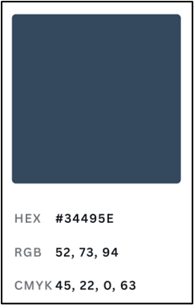
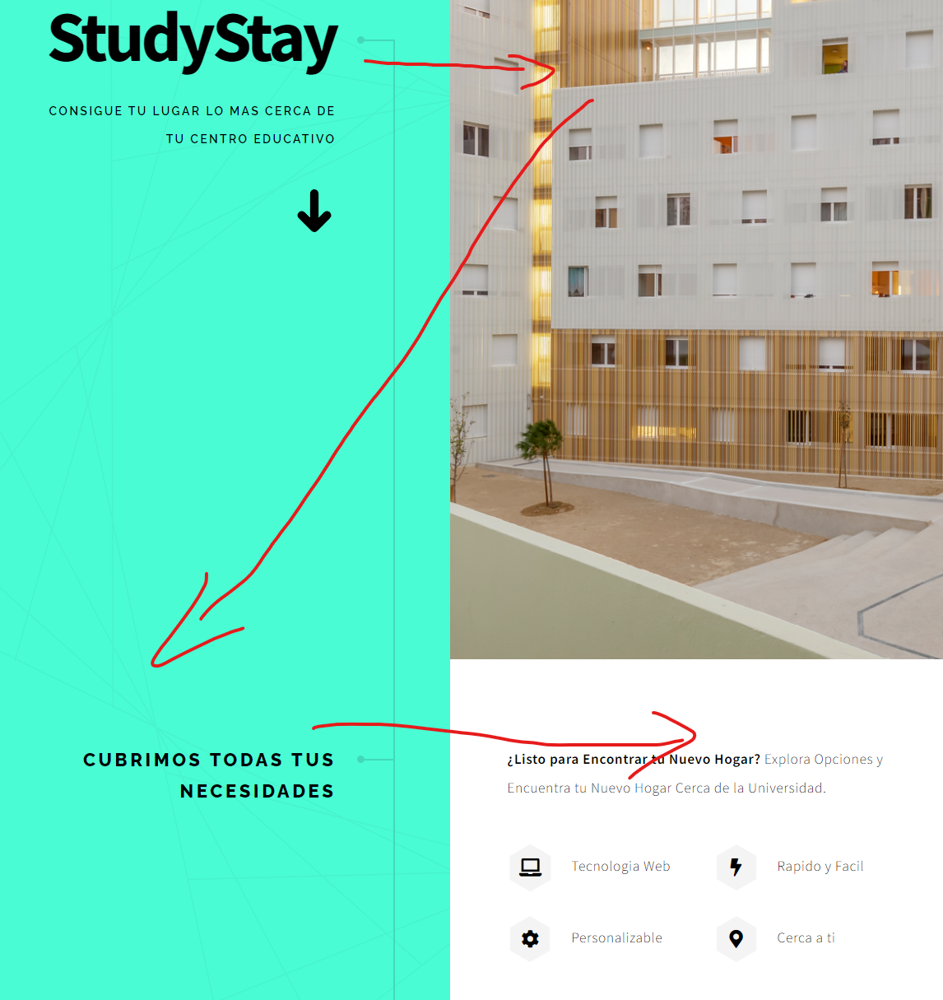
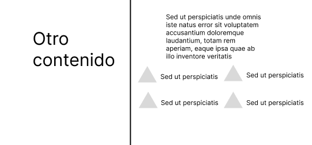
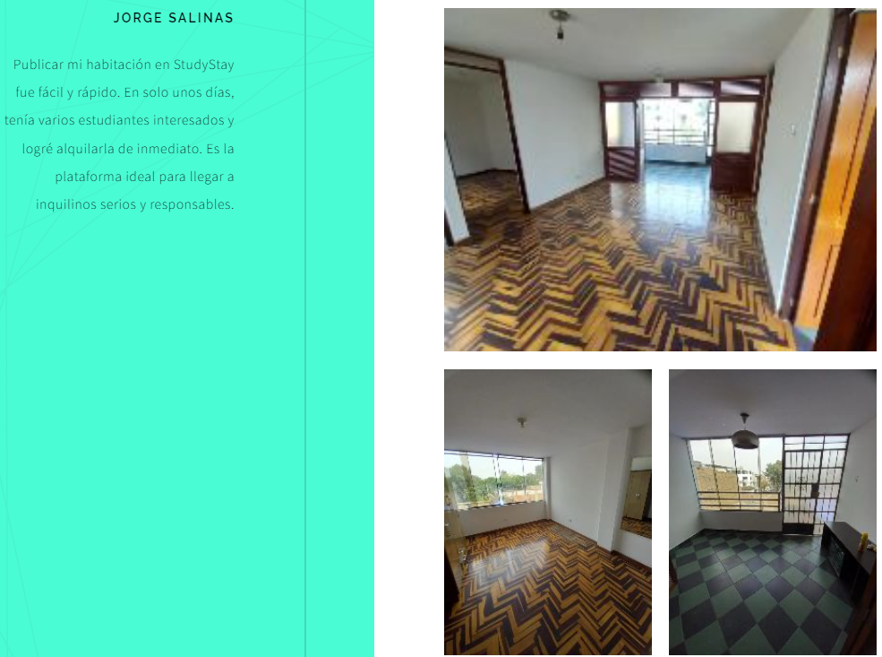
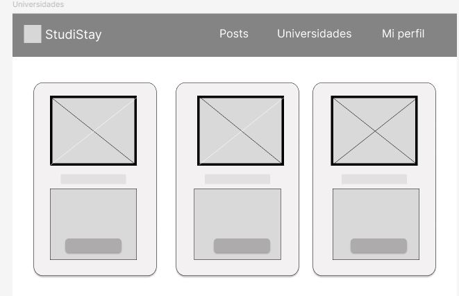
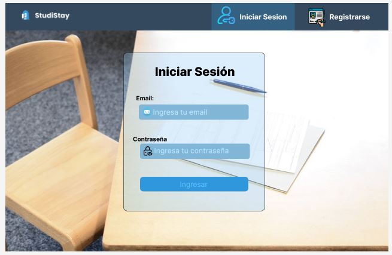
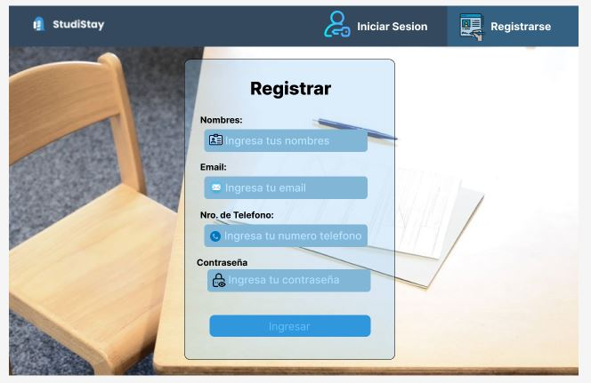
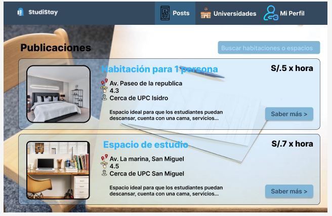
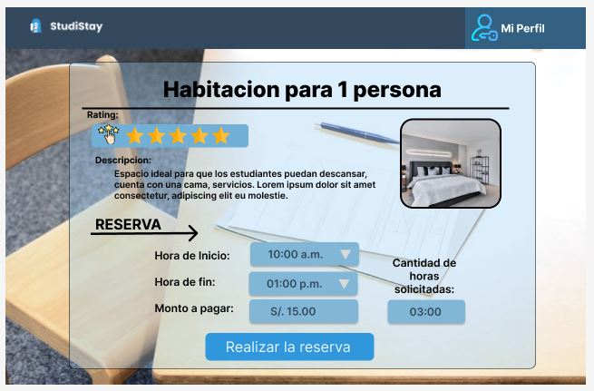

# Capítulo IV: Product Design

## 4.1. Style Guidelines.

### 4.1.1. General Style Guidelines.
En esta sección se analizará los diseños que se consideraron para nuestra marca. Debido a que es importante expresar las intenciones que tenemos con nuestros clientes. Además, se tendrá en cuenta que la tipografía y composición adopten un tono Casual/Formal, esto teniendo en cuenta nuestro público objetivo.

**- Logo:**
Nuestro logo está conformado por dos imágenes principales, las cuales son una casa y un árbol, esto hace referencia al servicio que se está brindando (el cual es la renta de habitaciones). Los colores usados fueron derivados del azul y blanco, el cual crea una paleta de colores que hace alusión a la paz, tranquilidad y seriedad, y refuerza la confianza de nuestros usuarios en el servicio que se brindará.

    

**- Tipografía:**
Se requirió dos tipos de tipografías claras, legibles y fáciles de leer en diferentes dispositivos. Fueron seleccionadas Poppins y Jost.

    

**- Colores empleados:**
Para la elección de colores, se tuvo en cuenta el propósito de la aplicación y el servicio y lo que esta debería transmitir al usuario.

    

    

**-Íconos:**
Con respecto a la parte de los iconos, estos serán simples y minimalistas para transmitir la información de manera sencilla y eficiente. Estos deben de adaptarse perfectamente a la interfaz de la aplicación, ocupando un espacio óptimo sin comprometer la legibilidad. Es por ello que su diseño minimalista ayuda a evitar la sobrecarga visual y permite una navegación fluida. Para este caso se usarán los íconos: Tabler-Icons

    

### 4.1.2. Web Style Guidelines.
En esta sección se explicará el estilo y patrón que hace uso nuestra interfaz tanto del landing page y la aplicación web.
**-Landing Page:** Esta utiliza el Patrón Z, una estructura diseñada para guiar al usuario por la página de manera natural y efectiva. En la parte superior se encontrará la barra de navegación con un tono oscuro, que brinda un aspecto serio y confiable. Esta barra contiene el logo y secciones como "Servicios", "Quiénes somos", "Testimonios" y "Aplicación". Se usaron colores derivados del azul el cual añade un toque de seriedad y paz al diseño y contrasta con el resto de la página para invitar al usuario a descargar y probar la aplicación.

    

## 4.2. Information Architecture

La arquitectura de la información para la **Landing Page** y la **Aplicación Web de StudyStay** se basa en decisiones estratégicas que permiten una navegación intuitiva, asegurando que los usuarios puedan encontrar rápidamente la información que buscan. Las propuestas están orientadas a facilitar la adaptación de los usuarios a la funcionalidad de cada producto, organizando el contenido de manera clara y accesible.

### 4.2.1. Organization Systems

En esta sección, el equipo define cómo se organizará el contenido utilizando diferentes sistemas de organización que se adaptan a los distintos grupos de información y tipos de usuarios.

**Segmento Objetivo: Estudiantes que buscan información sobre habitaciones**

- **Jerárquica**: Se utiliza una jerarquía visual en la **Landing Page** para presentar los espacios, habitaciones o departamentos, con los resultados de búsqueda ordenados según relevancia. Los artículos con mayor coincidencia con los filtros aplicados aparecerán primero, permitiendo a los usuarios elegir fácilmente su opción preferida.
- **Secuencial**: Durante el proceso de creación de cuentas en la **Aplicación Web**, la información se presentará de manera secuencial, guiando a los usuarios paso a paso a través de un flujo lógico hasta completar el registro.
- **Matricial**: En la **Aplicación Web**, la configuración de la cuenta permite a los usuarios personalizar aspectos de su perfil. Las opciones de configuración se mostrarán en un formato matricial, divididas en secciones para facilitar el acceso y la edición.

**Segmento Objetivo: Arrendadores que buscan alquilar habitaciones**

- **Jerárquica**: Para los arrendadores, los artículos se pueden organizar por categorías, y se les permitirá elegir el orden en el que quieren que sus publicaciones sean vistas por los estudiantes. Esto asegura que las opciones más relevantes aparezcan de manera prominente.
- **Secuencial**: Similar a los estudiantes, los arrendadores también seguirán un proceso secuencial para crear una cuenta, asegurando que se respeten los pasos necesarios para una inscripción exitosa.
- **Matricial**: Los arrendadores pueden configurar distintos aspectos de sus publicaciones y cuentas de forma matricial, permitiendo personalizar su información según sus preferencias.

### 4.2.2. Labeling Systems

El sistema de etiquetado debe ser simple, directo y claro, evitando cualquier confusión para los visitantes y usuarios. Las etiquetas deben proporcionar una descripción concisa del contenido.

- **Home**: Bienvenida a los usuarios con una frase representativa del proyecto.
- **Servicios**: Descripción de las características y beneficios del servicio para los usuarios.
- **Quiénes somos**: Información sobre el equipo de desarrollo y la misión del proyecto.
- **Testimonios**: Opiniones y puntuaciones de los usuarios que han utilizado el servicio.
- **Descargar**: Opciones de descarga para versiones móviles futuras.

### 4.2.3. SEO Tags and Meta Tags

Las etiquetas SEO y meta son cruciales para mejorar la visibilidad de la **Landing Page** y la **Aplicación Web** en los motores de búsqueda.

- **Landing Page**:
  - **Title**: StudiStay
  - **Description**: StudiStay - StudiStay Connect Official Landing Page
  - **Keywords**: apartment, students, rent apartment
  - **Authors**: StudiStay Connect team

- **Aplicación Web**:
  - **Title**: StudiStay
  - **Description**: StudiStay - StudiStay Connect Official Web Page
  - **Keywords**: apartment, students, rent apartment, low prices, web courses
  - **Authors**: StudiStay Connect team

### 4.2.4. Searching Systems

Los sistemas de búsqueda están diseñados para ayudar a los usuarios a encontrar rápidamente la información que necesitan sin sentirse perdidos.

- **Landing Page**: Los usuarios podrán navegar utilizando una barra de navegación en la parte superior de la página, que estará visible en todo momento. Esta barra proporcionará enlaces directos a las secciones más relevantes de la página.
- **Aplicación Web**: Los estudiantes podrán buscar espacios ideales aplicando filtros como precio, tamaño, y ubicación. Los arrendadores, por otro lado, podrán buscar clientes potenciales usando filtros como fecha y lugar. Los resultados se mostrarán según la relevancia de la búsqueda.

### 4.2.5. Navigation Systems

El sistema de navegación es fundamental para guiar a los usuarios a través del contenido de la **Landing Page** y la **Aplicación Web**, ayudándoles a cumplir sus objetivos de manera efectiva.

- **Landing Page**: Se utilizará una barra de navegación fija en la parte superior para permitir un acceso rápido a cualquier sección de la página. Los botones de acción y enlaces internos facilitarán la navegación fluida y eficiente.
- **Aplicación Web**: Similar a la **Landing Page**, con opciones adicionales de navegación que varían según el tipo de usuario (estudiante o arrendador). Los filtros y opciones de búsqueda guiadas permitirán una experiencia de usuario personalizada y efectiva.

## 4.3. Landing Page UI Design.

### 4.3.1. Landing Page Wireframe.

    

 

    

 

    

 

    

 

    

 

    

 

    

 
 

### 4.3.2. Landing Page Mock-up.

    

 

    

 

    

 

    

 

    

 

## 4.4. Web Applications UX/UI Design.

### 4.4.1. Web Applications Wireframes.

    

 

    

 

    

 

    

 

    

 

    

 

### 4.4.2. Web Applications Wireflow Diagrams.

 **User Goal:** Ingresar a la pantalla principal de la aplicacion

    

 

### 4.4.3. Web Applications Mock-ups.

    

 

    

 

    

 

    

 

    

 

    

 

### 4.4.4. Web Applications User Flow Diagrams.

## 4.5. Web Applications Prototyping.

## 4.6. Domain-Driven Software Architecture.

### 4.6.1. Software Architecture Context Diagram.

### 4.6.2. Software Architecture Container Diagrams.

### 4.6.3. Software Architecture Components Diagrams.

## 4.7. Software Object-Oriented Design.

### 4.7.1. Class Diagrams.

### 4.7.2. Class Dictionary.

## 4.8. Database Design.

### 4.8.1. Database Diagram.

