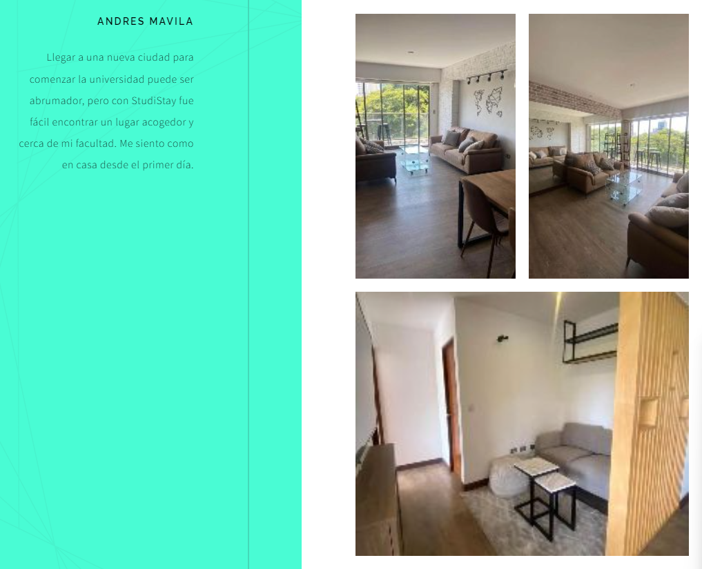

# Capítulo IV: Product Design

## 4.1. Style Guidelines.

### 4.1.1. General Style Guidelines.
En esta sección se analizará los diseños que se consideraron para nuestra marca. Debido a que es importante expresar las intenciones que tenemos con nuestros clientes. Además, se tendrá en cuenta que la tipografía y composición adopten un tono Casual/Formal, esto teniendo en cuenta nuestro público objetivo.

**- Logo:**
Nuestro logo está conformado por dos imágenes principales, las cuales son una casa y un árbol, esto hace referencia al servicio que se está brindando (el cual es la renta de habitaciones). Los colores usados fueron derivados del azul y blanco, el cual crea una paleta de colores que hace alusión a la paz, tranquilidad y seriedad, y refuerza la confianza de nuestros usuarios en el servicio que se brindará.

    

**- Tipografía:**
Se requirió dos tipos de tipografías claras, legibles y fáciles de leer en diferentes dispositivos. Fueron seleccionadas Poppins y Jost.

    

**- Colores empleados:**
Para la elección de colores, se tuvo en cuenta el propósito de la aplicación y el servicio y lo que esta debería transmitir al usuario.

    

    

**-Íconos:**
Con respecto a la parte de los iconos, estos serán simples y minimalistas para transmitir la información de manera sencilla y eficiente. Estos deben de adaptarse perfectamente a la interfaz de la aplicación, ocupando un espacio óptimo sin comprometer la legibilidad. Es por ello que su diseño minimalista ayuda a evitar la sobrecarga visual y permite una navegación fluida. Para este caso se usarán los íconos: Tabler-Icons

    

### 4.1.2. Web Style Guidelines.
En esta sección se explicará el estilo y patrón que hace uso nuestra interfaz tanto del landing page y la aplicación web.
**-Landing Page:** Esta utiliza el Patrón Z, una estructura diseñada para guiar al usuario por la página de manera natural y efectiva. En la parte superior se encontrará la barra de navegación con un tono oscuro, que brinda un aspecto serio y confiable. Esta barra contiene el logo y secciones como "Servicios", "Quiénes somos", "Testimonios" y "Aplicación". Se usaron colores derivados del azul el cual añade un toque de seriedad y paz al diseño y contrasta con el resto de la página para invitar al usuario a descargar y probar la aplicación.

    

## 4.2. Information Architecture.
En esta sección, estableceremos la estructura y forma del software en relación a nuestros segmentos objetivos, así como los elementos y características que se usarán dentro de la navegación de la aplicación.
### 4.2.1. Organization Systems.
Para crear la sección del Landing Page y la Aplicación web, hemos utilizado una estructura visual jerárquica en la página web, lo que nos permite asignar la ubicación apropiada a cada elemento necesario en este desarrollo. Para lograrlo, se considerarán factores como etiquetas, especificaciones de pantalla y resolución. Además, se diseñarán íconos utilizando una matriz, lo que optimizará la visualización de los detalles y contribuirá a mantener un proceso ordenado en todo momento.

**Segmento Objetivo: Estudiantes que buscan información sobre habitaciones**

- Jerárquica:
    - Al aplicar los filtros adecuados, los espacios, habitaciones o departamentos elegidos pueden aparecer con el debido orden, es decir, los artículos con mayor coincidencia aparecerán en primer lugar y así sucesivamente. El usuario tendrá la posibilidad de elegir el resultado de su agrado.
- Secuencial:
    - Para la creación de una cuenta para el uso de la aplicación, la información mostrada en pantalla deberá seguir una secuencia, en el que se deben respetar los pasos necesarios para que se pueda lograr con el cometido.
- Matricial:
    - En la configuración de la cuenta, los usuarios podrán configurar distintos aspectos de la misma de acuerdo a sus preferencias, mostrando los apartados divididos en secciones.

**Segmento Objetivo: Arrendadores que buscan alquilar habitaciones**

- Jerárquica:
    - Cuando se desee publicar artículos organizados por categorías, podrá elegir el orden en el que quiera que se visualice para los estudiantes, por lo que se presentará de forma ordenada.

- Secuencial:
    - Para la creación de una cuenta para el uso de la aplicación, la información mostrada en pantalla deberá seguir una secuencia, en el que se deben respetar los pasos necesarios para que se pueda lograr con el cometido.

- Matricial:
    - En la configuración de la cuenta, los usuarios podrán configurar distintos aspectos de la misma de acuerdo a sus preferencias, mostrando los apartados divididos en secciones.

### 4.2.2. Labeling Systems.
A continuación, se mostrará el sistema de etiquetado que otorgará una descripción breve y clara de la información mostrada en nuestra Landing Page.

Tenemos los siguientes encabezados:

- Home: En esta sección se muestra la sección inicial de la Landing Page, en la que se ofrece la bienvenida a los posibles usuarios, junto a una frase que representa al proyecto.
- Servicios: En esta sección se describen las características que los usuarios podrán encontrar al hacer uso de nuestra aplicación.
- Quiénes somos: En esta sección el cliente puede observar información acerca de nuestro equipo de desarrollo y una descripción breve de nuestro objetivo.
- Testimonios: En esta sección se pueden visualizar las opiniones de los usuarios que probaron el servicio, además de la puntuación que brindaron.
- Descargar: En esta sección se puede visualizar las opciones de descarga que podrán estar disponibles en un posible futuro al desarrollar una versión para dispositivos móviles.

### 4.2.3. SEO Tags and Meta Tags

Estas etiquetas son esenciales para mejorar la visibilidad de la aplicación web en los motores de búsqueda como Google. Las etiquetas SEO incluyen palabras clave relevantes y descripciones concisas para que los motores de búsqueda indexen y clasifiquen el contenido de la aplicación de manera efectiva. Las metaetiquetas proporcionan información adicional sobre la página, como el título y la descripción que se muestran en los resultados de búsqueda.

**Para el Landing Page:**

Tittle: StudiStay
Description: StudiStay -  StudiStay Connect Official Landing Page
Keywords: apartment, students, rent apartment
Authors: StudiStay Connect team

**Para la aplicación web:**

Tittle: StudiStay
Description: StudiStay -  StudiStay Connect Official Web Page
Keywords: apartment, students, rent apartment, low prices, web courses
Authors: StudiStay Connect team

### 4.2.4. Searching Systems.
- Landing Page: Los usuarios podrán hacer uso de la barra de navegación ubicada en la parte superior, para poder ubicarse en los distintos apartados en los que está dividido nuestra página, siendo una forma didáctica para interactuar con esta.

- Aplicación Web: Por parte de los estudiantes, tendrán la opción de realizar búsquedas de espacios ideales para ellos, por medio de aplicar los filtros necesarios tales como precio, tamaño, lugar, etc. Los resultados serán mostrados de acuerdo a la coincidencia con la búsqueda establecida. Por parte de los arrendadores, podrán buscar a los clientes con quienes contactaron para realizar un alquiler, por medio de filtros como fecha, lugar, etc.

### 4.2.5. Navigation Systems.
A continuación, el equipo mostrará los sistemas de navegación con los que contará nuestro servicio para permitir a los usuarios navegar de manera sencilla y eficiente a cualquier sección de información.

En nuestro Landing Page, encontramos la sección de la barra de navegación en la parte superior, la cual nos permite navegar directamente a un apartado dentro de la página. Esta barra de navegación será visible en todo momento, para que el usuario pueda dirigirse a otra sección que desee visualizar. De esta manera, generamos una navegación más fluida y dinámica para el usuario.

En nuestra aplicación web, utilizaremos un proceso similar al descrito, con diversas opciones que variarán de acuerdo al segmento objetivo que esté utilizando el servicio. Estos podrán hacer uso de filtros para poder encontrar de mejor manera la información precisa que necesiten.

## 4.3. Landing Page UI Design.

### 4.3.1. Landing Page Wireframe.

    

 

    

 

    

 

    

 

    

 
 

### 4.3.2. Landing Page Mock-up.

    

 

    

 

    

 

    

 

    

 

## 4.4. Web Applications UX/UI Design.

### 4.4.1. Web Applications Wireframes.

### 4.4.2. Web Applications Wireflow Diagrams.

### 4.4.3. Web Applications Mock-ups.

### 4.4.4. Web Applications User Flow Diagrams.

## 4.5. Web Applications Prototyping.

## 4.6. Domain-Driven Software Architecture.

### 4.6.1. Software Architecture Context Diagram.

### 4.6.2. Software Architecture Container Diagrams.

### 4.6.3. Software Architecture Components Diagrams.

## 4.7. Software Object-Oriented Design.

### 4.7.1. Class Diagrams.

### 4.7.2. Class Dictionary.

## 4.8. Database Design.

### 4.8.1. Database Diagram.

