# Capítulo VI: Product Verification & Validation

## 6.1. Testing Suites & Validation

### 6.1.1. Core Entities Unit Tests
En esta fase de pruebas, se validan las entidades principales del sistema, como `Post`, `Reservation` y `User`. Se trata de pruebas unitarias que verifican que los componentes más pequeños de la aplicación funcionen de manera correcta y aislada. 

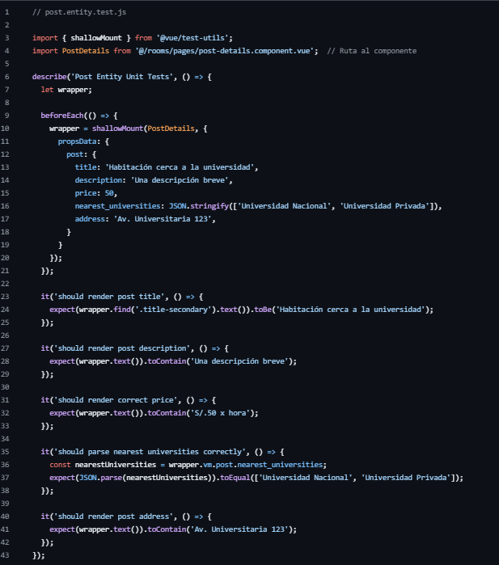
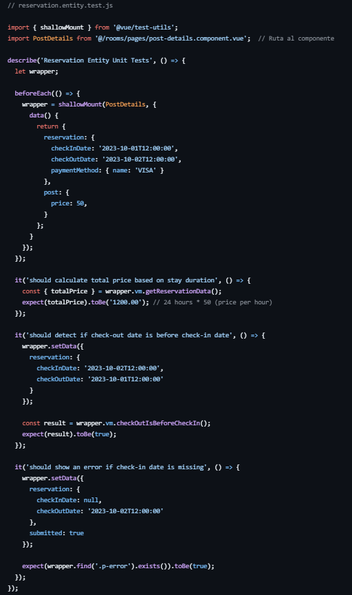
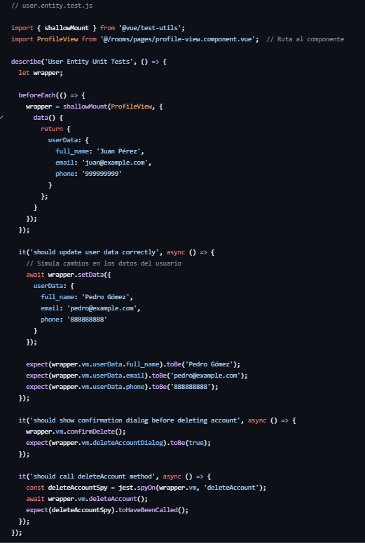

### 6.1.2. Core Integration Tests
Las pruebas de integración se centran en verificar que los diferentes módulos o componentes de la aplicación interactúen correctamente entre ellos. Para estas pruebas, simulamos flujos completos, como la creación de posts o reservas, asegurándonos de que las entidades trabajen de forma correcta al unísono.
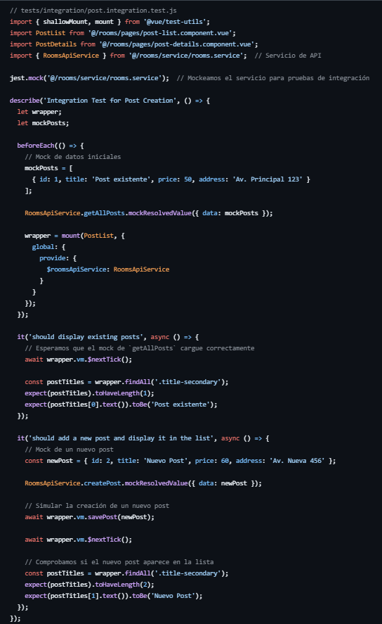
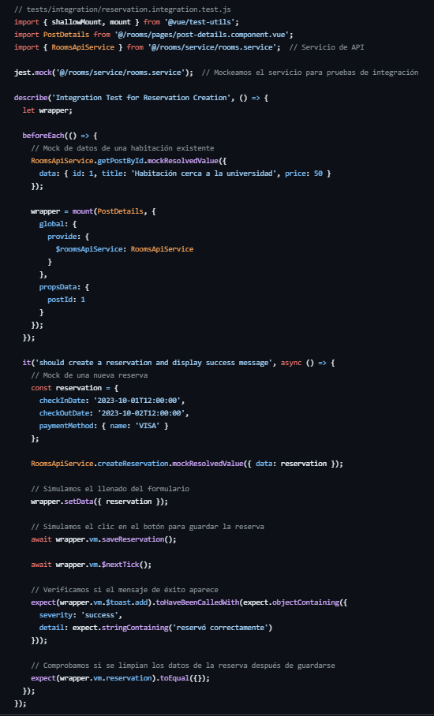
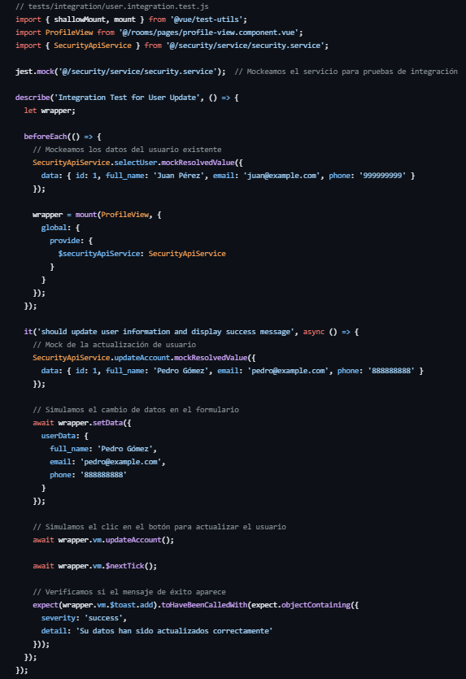

### 6.1.3. Core Behavior-Driven Development
En el marco de BDD (Behavior-Driven Development), nos centramos en describir el comportamiento esperado del sistema desde la perspectiva del usuario final. Utilizamos **Jest-Cucumber** para escribir las pruebas en formato **Gherkin**, lo que permite definir escenarios con `Given`, `When`, y `Then`. Esto asegura que el sistema se comporta correctamente según los requisitos establecidos, probando casos como la creación de un post o la reserva de una habitación.

Feature: Crear un nuevo post

  Scenario: El usuario crea un nuevo post con éxito
    Given que el usuario está en la página de creación de post
    When el usuario introduce los datos del post "Nuevo Post" con el precio "50"
    And el usuario guarda el post
    Then el nuevo post debe aparecer en la lista de publicaciones

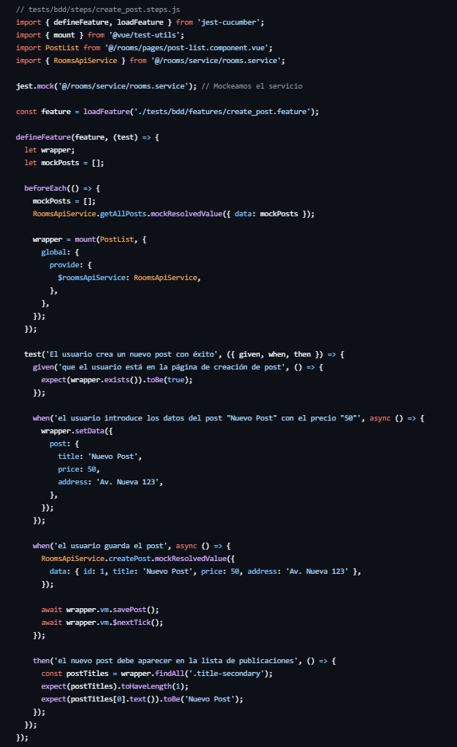

Feature: Crear una nueva reserva

  Scenario: El usuario reserva una habitación con éxito
    Given que el usuario está viendo los detalles de una habitación
    When el usuario introduce la fecha de check-in "2023-10-01T12:00:00" y check-out "2023-10-02T12:00:00"
    And selecciona el método de pago "VISA"
    And guarda la reserva
    Then la reserva debe ser creada correctamente
    And el mensaje de éxito debe aparecer

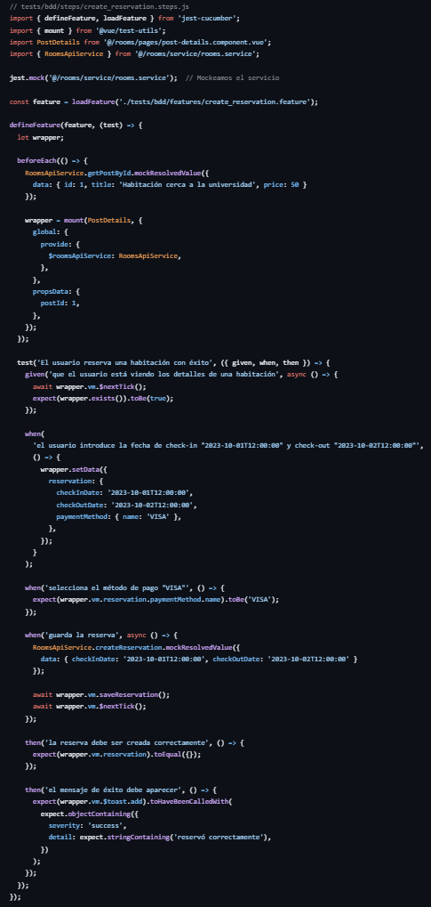

### 6.1.4. Core System Tests
Las pruebas del sistema verifican el comportamiento del sistema en su conjunto, incluyendo todas las partes integradas (frontend, backend, base de datos). Estas pruebas simulan interacciones de usuario reales y aseguran que todo el flujo del sistema funcione sin problemas, desde la capa de presentación hasta la base de datos. 

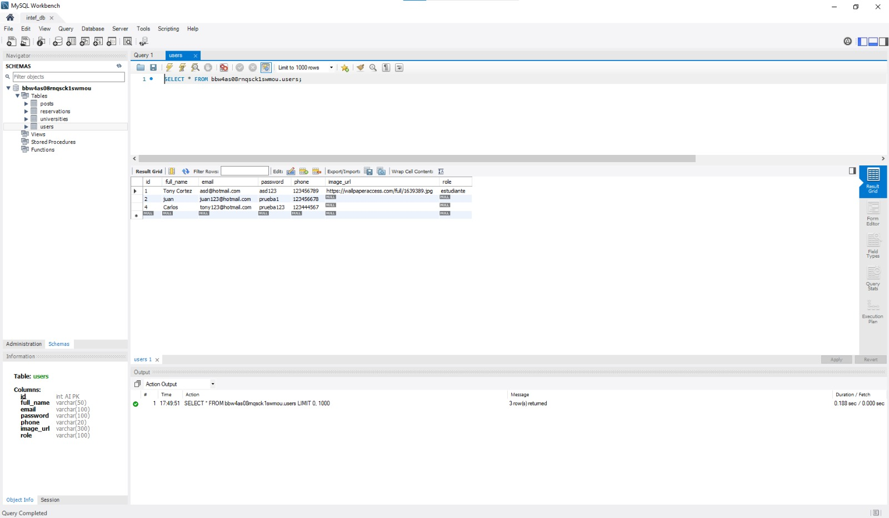
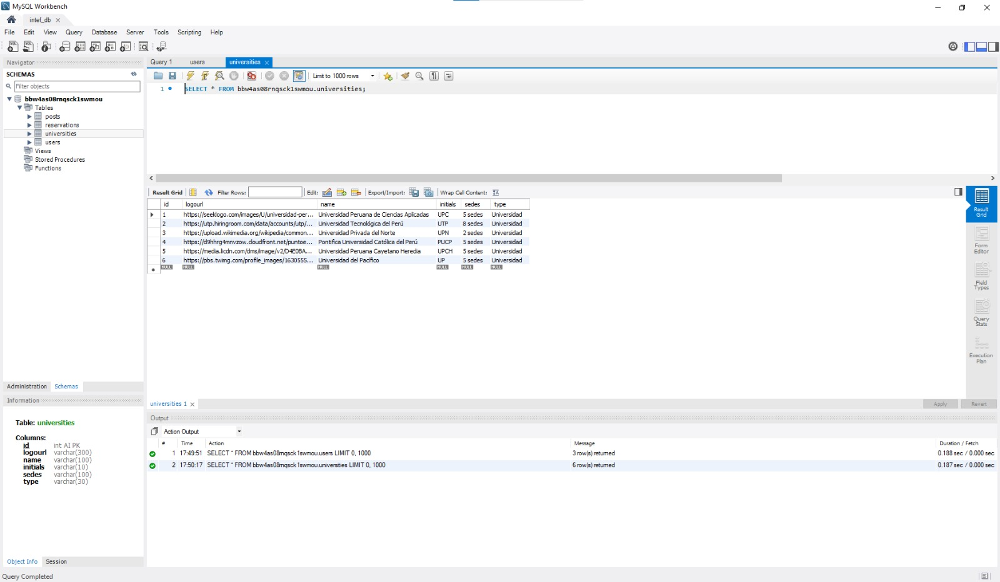
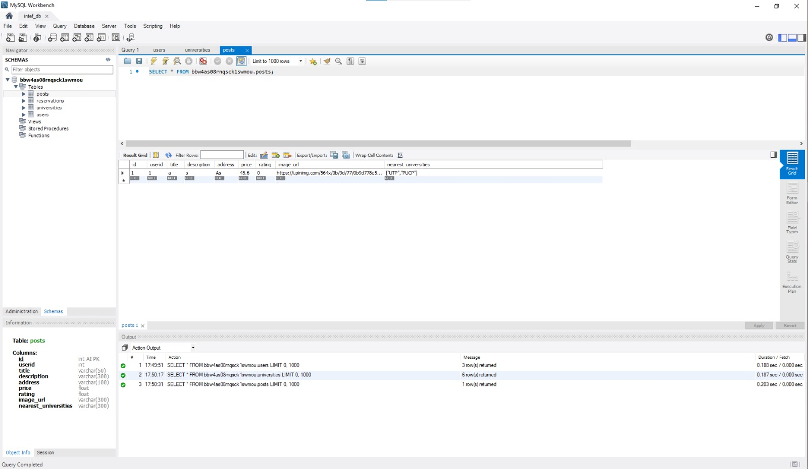

