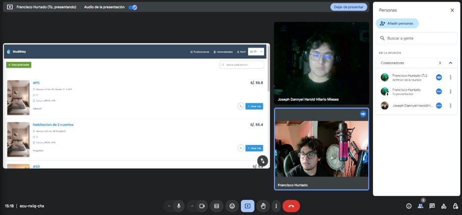

### **8.1. Experiment Planning**

#### **8.1.1. As-Is Summary**
Esta evaluación describe el funcionamiento operativo de la aplicación en su forma actual, centrándose en las experiencias tanto de los arrendadores como de los estudiantes. A continuación, se presenta el análisis.

**Estado actual:**  
La plataforma **StudiStay** permite a los estudiantes universitarios buscar alojamiento cerca de sus centros educativos y facilita a los arrendadores la publicación de habitaciones disponibles. En su versión actual, la plataforma opera con una interfaz web básica y funcional que cubre las tareas esenciales de conexión entre ambas partes.

**Funcionalidades Actuales**
1. **Búsqueda y Filtros Básicos:**
    - Los estudiantes pueden buscar habitaciones por ubicación y precio.
    - Los filtros disponibles son limitados (por ejemplo: precio y tipo de habitación), lo que podría restringir la precisión en la búsqueda.

2. **Publicación de Propiedades:**
    - Los arrendadores pueden subir información básica sobre la habitación (precio, fotos y descripción).
    - Sin embargo, la falta de plantillas estándar puede dar lugar a descripciones inconsistentes y menos atractivas.

3. **Monetización:**
    - Se ofrecen suscripciones premium para estudiantes que desbloquean algunas ventajas, como búsquedas destacadas.
    - No existe un modelo claro de incentivos para los arrendadores.

**Problemas Identificados**
1. **Experiencia del Usuario Inconsistente:**
    - La navegación por la plataforma no es completamente intuitiva, lo que puede dificultar la adopción por parte de usuarios novatos.
    - La interfaz es funcional, pero carece de elementos modernos que faciliten la interacción rápida y atractiva.

2. **Limitaciones en las Funcionalidades de Filtros:**
    - Los filtros actuales son insuficientes para las necesidades específicas de los usuarios, como opciones por cercanía a servicios específicos (bibliotecas, transporte, etc.).

3. **Ausencia de Incentivos Efectivos para Arrendadores:**
    - La plataforma no ofrece recompensas claras o incentivos económicos que fomenten la publicación continua de habitaciones.

**Oportunidades de Mejora**
1. **Ampliación de los Filtros de Búsqueda:**
    - Incorporar filtros más detallados basados en la proximidad a puntos de interés y características específicas de las habitaciones.

2. **Implementación de Notificaciones Inteligentes:**
    - Incluir notificaciones en tiempo real para recordar a los usuarios sobre mensajes no leídos o cambios en las publicaciones.

3. **Sistema de Valoraciones y Reputación:**
    - Introducir un sistema de calificación para estudiantes y arrendadores, generando confianza y aumentando la calidad del servicio.

---

#### **8.1.2. Raw Material: Assumptions, Knowledge Gaps, Ideas, Claims**

Para comprender mejor el punto de partida de **StudiStay** y definir la dirección de los próximos experimentos, es fundamental detenernos en las suposiciones que guían el desarrollo, las dudas aún no resueltas, las ideas emergentes y las afirmaciones que necesitan validarse.

**Assumptions: Lo que Creemos hasta Ahora**
- Los estudiantes valoran la precisión en la búsqueda. Creemos que ofrecer filtros más detallados y específicos (como la cercanía a transporte o servicios) facilitará que los estudiantes encuentren alojamientos más alineados con sus expectativas.
- Un sistema de mensajería robusto mejorará la comunicación. Imaginamos que, al ofrecer notificaciones en tiempo real y herramientas de gestión de mensajes, tanto arrendadores como estudiantes se sentirán más conectados y atendidos.
- Los incentivos pueden motivar la participación de los arrendadores. Partimos de la idea de que, si ofrecemos reconocimientos o ventajas por mantener una alta tasa de ocupación, los arrendadores se animarán a publicar más habitaciones.
- Los planes premium serán más atractivos si se comunican mejor. Creemos que los estudiantes estarán dispuestos a pagar por estos planes si perciben con claridad los beneficios que ofrecen, como prioridad en las búsquedas o acceso anticipado a anuncios.

**Knowledge Gaps: Lo que Todavía No Sabemos**
- ¿Qué buscan realmente los estudiantes al elegir un alojamiento? Sabemos que el precio y la ubicación importan, pero ¿qué otros factores podrían ser decisivos?
- ¿Cómo perciben los arrendadores la plataforma hoy en día? Necesitamos entender si el proceso actual de publicación les resulta sencillo o si hay fricciones.
- ¿Qué incentivos motivarían a los arrendadores? No tenemos claro qué recompensas serían más valoradas: ¿visibilidad adicional? ¿descuentos en tarifas?
- ¿Por qué los planes premium no son más populares? Nos hace falta identificar qué beneficios extra serían suficientes para convencer a más estudiantes de que valen la pena.

**Ideas: Cómo Podríamos Mejorar**
1. **Filtros de búsqueda más completos y específicos:**
    - Agregar opciones como cercanía a bibliotecas, transporte público o servicios esenciales podría hacer más eficiente el proceso de búsqueda.

2. **Notificaciones inteligentes y recordatorios automáticos:**
    - Un sistema que avise sobre mensajes no respondidos o nuevas publicaciones basadas en búsquedas guardadas podría mejorar la interacción entre los usuarios.

3. **Recompensas para los arrendadores más activos:**
    - Un sistema de ranking que destaque a los mejores arrendadores, acompañado de incentivos como mayor visibilidad, podría fomentar la participación continua.

4. **Planes premium con beneficios personalizados:**
    - Ofrecer diferentes niveles de suscripción, con ventajas escalonadas, permitiría a los estudiantes elegir el plan que más se adapte a sus necesidades.

**Claims: Lo que Necesitamos Validar**
- Las notificaciones inteligentes mejorarán la tasa de respuesta. Estamos convencidos de que, al implementar alertas en tiempo real, los arrendadores responderán más rápido, incrementando la interacción en un 30%.
- Los incentivos atraerán a más arrendadores. Apostamos por la idea de que las recompensas y reconocimientos aumentarán las publicaciones en un 40% en los próximos seis meses.
- Los planes premium personalizados atraerán más suscriptores. Si comunicamos de manera más clara las ventajas de cada nivel de suscripción, estimamos un incremento del 15% en las ventas de estos planes.

---

#### **8.1.3. Experiment-Ready Questions**

Estas preguntas listas para la experimentación nos permitirán enfocarnos en aspectos concretos de la plataforma, obteniendo datos que respalden nuestras decisiones.

**Preguntas sobre Filtros y Búsqueda**
1. ¿Cuáles son los filtros más utilizados por los estudiantes al buscar alojamiento?
2. ¿La incorporación de filtros avanzados incrementa el número de reservas exitosas?
3. ¿Qué impacto tiene la posibilidad de guardar búsquedas en la retención de usuarios?

**Preguntas sobre Incentivos y Recompensas para Arrendadores**
7. ¿Los incentivos basados en desempeño aumentan la frecuencia de publicaciones de habitaciones?
8. ¿Cómo reaccionan los arrendadores a un sistema de clasificación que resalte su desempeño?

**Preguntas sobre Planes Premium y Modelo de Monetización**
9. ¿Los beneficios adicionales en los planes premium incrementan las suscripciones?
10. ¿Qué tan dispuestos están los estudiantes a pagar por beneficios exclusivos dentro de la plataforma?

### **8.1.4. Question Backlog**

| **Área**                  | **Pregunta**                                                                                     | **Prioridad** | **Objetivo**                                      |
|---------------------------|---------------------------------------------------------------------------------------------------|--------------|--------------------------------------------------|
| **Filtros y Búsqueda**     | ¿Cuáles son los filtros más utilizados por los estudiantes al buscar alojamiento?                 | Alta         | Identificación clara de filtros preferidos       |
|                           | ¿La incorporación de filtros avanzados incrementa el número de reservas exitosas?                  | Alta         | Aumento del 20% en reservas                      |
|                           | ¿Qué impacto tiene la posibilidad de guardar búsquedas en la retención de usuarios?                | Media        | Incremento en la tasa de usuarios recurrentes    |
| **Incentivos y Recompensas** | ¿Los incentivos basados en desempeño aumentan la frecuencia de publicaciones de habitaciones?    | Media        | Incremento del 40% en publicaciones              |
|                           | ¿Cómo reaccionan los arrendadores a un sistema de clasificación que resalte su desempeño?           | Media        | Mejor reputación e interacción                   |
| **Planes Premium y Monetización** | ¿Los beneficios adicionales en los planes premium incrementan las suscripciones?             | Alta         | Incremento del 15% en suscripciones              |
|                           | ¿Qué tan dispuestos están los estudiantes a pagar por beneficios exclusivos dentro de la plataforma? | Media        | Incremento en adopción de planes premium         |

### **8.1.5. Experiment Cards**

#### **Experiment Card 1 – Filtros más utilizados por los estudiantes**
- **Question:**  
  ¿Cuáles son los filtros más utilizados por los estudiantes al buscar alojamiento?
- **Why:**  
  Entender qué filtros prefieren los estudiantes permitirá priorizarlos y mejorar la experiencia de búsqueda.
- **What:**  
  Analizar los filtros más utilizados en un periodo de 3 meses para determinar cuáles optimizan mejor las búsquedas.
- **Hipótesis:**  
  Los filtros de **precio** y **cercanía al transporte** serán usados en el 70% de las búsquedas realizadas.

---

#### **Experiment Card 2 – Impacto de filtros avanzados en reservas exitosas**
- **Question:**  
  ¿La incorporación de filtros avanzados incrementa el número de reservas exitosas?
- **Why:**  
  Evaluar si más opciones de búsqueda influyen positivamente en las reservas.
- **What:**  
  Implementar filtros como **Wi-Fi** y **servicios cercanos**, y medir el impacto en reservas durante 3 meses.
- **Hipótesis:**  
  Las reservas aumentarán en un **25%** después de 3 meses de activar los nuevos filtros.

---

#### **Experiment Card 3 – Guardar búsquedas y retención de usuarios**
- **Question:**  
  ¿Qué impacto tiene la posibilidad de guardar búsquedas en la retención de usuarios?
- **Why:**  
  Identificar si esta función incrementa la frecuencia de retorno de los usuarios.
- **What:**  
  Permitir guardar búsquedas y analizar el retorno de usuarios en un plazo de 6 meses.
- **Hipótesis:**  
  La tasa de **usuarios recurrentes** aumentará en un **20%** en los 6 meses posteriores a la implementación.

---

#### **Experiment Card 4 – Incentivos basados en desempeño para arrendadores**
- **Question:**  
  ¿Los incentivos basados en desempeño aumentan la frecuencia de publicaciones de habitaciones?
- **Why:**  
  Medir si los incentivos motivan a los arrendadores a participar más activamente.
- **What:**  
  Ofrecer **mayor visibilidad** como incentivo y medir el aumento de publicaciones en 3 meses.
- **Hipótesis:**  
  La frecuencia de publicaciones aumentará en un **35%** en el periodo de 3 meses.

---

#### **Experiment Card 5 – Clasificación de arrendadores y su desempeño**
- **Question:**  
  ¿Cómo reaccionan los arrendadores a un sistema de clasificación que resalte su desempeño?
- **Why:**  
  Evaluar si un sistema de rankings mejora la calidad y cantidad de publicaciones.
- **What:**  
  Implementar un **sistema de ranking** y medir su impacto durante 6 meses.
- **Hipótesis:**  
  La **calidad de las publicaciones** mejorará en un **30%**, y las publicaciones aumentarán en un **20%**.

---

#### **Experiment Card 6 – Disposición de los estudiantes a pagar por beneficios exclusivos**
- **Question:**  
  ¿Qué tan dispuestos están los estudiantes a pagar por beneficios exclusivos dentro de la plataforma?
- **Why:**  
  Conocer la disposición de pago permitirá diseñar planes más atractivos.
- **What:**  
  Realizar **encuestas y pruebas piloto** durante 2 meses para evaluar el interés por planes exclusivos.
- **Hipótesis:**  
  Al menos el **50%** de los encuestados estarán dispuestos a pagar por beneficios adicionales de hasta **50 soles mensuales**.

### **Experiment Card 1 – Filtros más utilizados por los estudiantes**

| **Question**  | ¿Cuáles son los filtros más utilizados por los estudiantes al buscar alojamiento? |
|---------------|----------------------------------------------------------------------------------|
| **Why**       | Entender qué filtros prefieren los estudiantes permitirá priorizarlos y mejorar la experiencia de búsqueda. |
| **What**      | Analizar los filtros más utilizados en un periodo de 3 meses para determinar cuáles optimizan mejor las búsquedas. |
| **Hipótesis** | Los filtros de **precio** y **cercanía al transporte** serán usados en el 70% de las búsquedas realizadas. |

---

### **Experiment Card 2 – Impacto de filtros avanzados en reservas exitosas**

| **Question**  | ¿La incorporación de filtros avanzados incrementa el número de reservas exitosas? |
|---------------|-----------------------------------------------------------------------------------|
| **Why**       | Evaluar si más opciones de búsqueda influyen positivamente en las reservas.        |
| **What**      | Implementar filtros como **Wi-Fi** y **servicios cercanos**, y medir el impacto en reservas durante 3 meses. |
| **Hipótesis** | Las reservas aumentarán en un **25%** después de 3 meses de activar los nuevos filtros. |

---

### **Experiment Card 3 – Guardar búsquedas y retención de usuarios**

| **Question**  | ¿Qué impacto tiene la posibilidad de guardar búsquedas en la retención de usuarios? |
|---------------|------------------------------------------------------------------------------------|
| **Why**       | Identificar si esta función incrementa la frecuencia de retorno de los usuarios.    |
| **What**      | Permitir guardar búsquedas y analizar el retorno de usuarios en un plazo de 6 meses. |
| **Hipótesis** | La tasa de **usuarios recurrentes** aumentará en un **20%** en los 6 meses posteriores a la implementación. |

---

**Experiment Card 4 – Incentivos basados en desempeño para arrendadores**

| **Question**  | ¿Los incentivos basados en desempeño aumentan la frecuencia de publicaciones de habitaciones? |
|---------------|------------------------------------------------------------------------------------------------|
| **Why**       | Medir si los incentivos motivan a los arrendadores a participar más activamente.               |
| **What**      | Ofrecer **mayor visibilidad** como incentivo y medir el aumento de publicaciones en 3 meses.    |
| **Hipótesis** | La frecuencia de publicaciones aumentará en un **35%** en el periodo de 3 meses.                |

---

**Experiment Card 5 – Clasificación de arrendadores y su desempeño**

| **Question**  | ¿Cómo reaccionan los arrendadores a un sistema de clasificación que resalte su desempeño? |
|---------------|--------------------------------------------------------------------------------------------|
| **Why**       | Evaluar si un sistema de rankings mejora la calidad y cantidad de publicaciones.           |
| **What**      | Implementar un **sistema de ranking** y medir su impacto durante 6 meses.                  |
| **Hipótesis** | La **calidad de las publicaciones** mejorará en un **30%**, y las publicaciones aumentarán en un **20%**. |

---

**Experiment Card 6 – Disposición de los estudiantes a pagar por beneficios exclusivos**

| **Question**  | ¿Qué tan dispuestos están los estudiantes a pagar por beneficios exclusivos dentro de la plataforma? |
|---------------|-----------------------------------------------------------------------------------------------------|
| **Why**       | Conocer la disposición de pago permitirá diseñar planes más atractivos.                               |
| **What**      | Realizar **encuestas y pruebas piloto** durante 2 meses para evaluar el interés por planes exclusivos. |
| **Hipótesis** | Al menos el **50%** de los estudiantes encuestados estarán dispuestos a pagar por beneficios adicionales de hasta **50 soles mensuales**. |

### **8.2. Experiment Design**
El diseño de los experimentos para **StudiStay** está pensado para validar hipótesis específicas que puedan tener un impacto directo en la plataforma. La idea es aplicar cambios graduales en distintas funcionalidades, medir resultados concretos y ajustar lo necesario con base en los datos obtenidos.

---

### **8.2.1 Hypotheses**
Estas hipótesis no solo se centran en las expectativas generales sino también en los aspectos técnicos específicos que se pondrán a prueba en la implementación.

#### **Hypothesis 1 – Filtros más utilizados por los estudiantes**
- **Hipótesis:**  
  Los filtros de precio y cercanía al transporte serán utilizados en el 70% de las búsquedas realizadas durante los primeros tres meses.
- **Aspecto técnico de la hipótesis:**  
  Se desplegarán estos filtros de manera prominente en la interfaz principal de búsqueda y se agregarán métricas de uso en el backend para registrar su frecuencia de aplicación. Los datos se almacenarán en tiempo real para detectar patrones emergentes.
- **Posible prueba A/B:**  
  Se comparará el uso entre la versión original y la que incluye los filtros destacados para asegurar la mejora.

---

#### **Hypothesis 2 – Impacto de filtros avanzados en reservas exitosas**
- **Hipótesis:**  
  La implementación de filtros avanzados (Wi-Fi, tipo de contrato y cercanía a servicios) incrementará las reservas exitosas en un 25% dentro de los primeros 90 días.
- **Aspecto técnico de la hipótesis:**  
  Estos filtros se integrarán mediante etiquetas dinámicas y una API que conecte con datos externos (como mapas de transporte y puntos de interés cercanos). Los desarrolladores asegurarán que los tiempos de carga no se vean afectados por los nuevos filtros.
- **Posible métrica técnica:**  
  Se medirán las conversiones generadas a partir de búsquedas filtradas y el tiempo de navegación hasta completar una reserva.

---

#### **Hypothesis 3 – Guardar búsquedas y retención de usuarios**
- **Hipótesis:**  
  La posibilidad de guardar búsquedas aumentará la retención de usuarios en un 20% en los primeros seis meses.
- **Aspecto técnico de la hipótesis:**  
  Se añadirá una opción para guardar búsquedas en el perfil del usuario. Esta funcionalidad será gestionada mediante cookies y se sincronizará con la base de datos para permitir el acceso desde múltiples dispositivos.
- **Posible prueba técnica:**  
  Se evaluará el rendimiento de la base de datos con usuarios activos y se optimizará la carga para evitar demoras al guardar o recuperar búsquedas.

---

#### **Hypothesis 4 – Incentivos basados en desempeño para arrendadores**
- **Hipótesis:**  
  Los incentivos basados en mayor visibilidad incrementarán la frecuencia de publicaciones en un 35% en tres meses.
- **Aspecto técnico de la hipótesis:**  
  Se diseñará un sistema automatizado que destaque las propiedades más activas y consistentes en resultados de búsqueda. El algoritmo considerará la frecuencia de publicación y la tasa de ocupación para asignar beneficios automáticamente.
- **Posible prueba técnica:**  
  Se analizará si el aumento de publicaciones afecta el rendimiento del servidor o los tiempos de carga en la interfaz.

---

#### **Hypothesis 5 – Clasificación de arrendadores y su desempeño**
- **Hipótesis:**  
  La introducción de un sistema de clasificación mejorará la calidad de las publicaciones en un 30% y aumentará el volumen en un 20% en seis meses.
- **Aspecto técnico de la hipótesis:**  
  El sistema de ranking se basará en un algoritmo que ponderará el tiempo de respuesta, las valoraciones de los usuarios y la frecuencia de publicación. La clasificación se actualizará en tiempo real y se mostrará en los perfiles de los arrendadores.
- **Posibles métricas:**  
  Se medirá la evolución de las calificaciones de los arrendadores y la variación en la cantidad de publicaciones antes y después de implementar el ranking.

---

### **8.2.2 Measures**
A continuación, se presenta un cuadro detallado de las métricas que se utilizarán para cada experimento. Estas métricas han sido seleccionadas para garantizar una evaluación precisa y orientada a resultados, con submétricas específicas para profundizar en los aspectos clave del desempeño de la plataforma **StudiStay**.

| **Experimento** | **Métrica de Éxito** | **Submétricas** | **Posible Herramienta de Monitoreo** |
|----------------|----------------------|----------------|--------------------------------------|
| **Filtros más utilizados por los estudiantes** | ≥ 70% de las búsquedas usan filtros de precio o cercanía al transporte en un periodo de 3 meses. | - **Tasa de uso por filtro:** Número de veces que cada filtro es aplicado por usuario.   - **Tiempo promedio de búsqueda:** Tiempo desde el inicio de la búsqueda hasta que se selecciona un alojamiento. | - Google Analytics o solución interna para rastreo de eventos en tiempo real.   - Logs del backend para registrar filtros aplicados. |
| **Impacto de filtros avanzados en reservas exitosas** | Incremento del 25% en reservas mediante el uso de filtros avanzados (Wi-Fi, servicios cercanos) en 3 meses. | - **Tasa de abandono:** Proporción de usuarios que inician búsquedas avanzadas, pero no completan la reserva.   - **Conversión por filtro:** Número de reservas asociadas a cada filtro avanzado. | - API de tracking de eventos y comparación entre tasas de conversión en filtros básicos y avanzados. |
| **Guardar búsquedas y retención de usuarios** | Aumento del 20% en la recurrencia de usuarios en 6 meses. | - **Tasa de retorno:** Número de usuarios que regresan y reutilizan búsquedas guardadas.   - **Satisfacción del usuario:** Encuestas rápidas después del uso de la funcionalidad de guardado. | - Sincronización de base de datos y cookies para rastreo multi-dispositivo.   - Encuestas dentro de la plataforma. |
| **Incentivos basados en desempeño para arrendadores** | Incremento del 35% en publicaciones en un periodo de 3 meses. | - **Frecuencia de publicaciones por arrendador:** Número de publicaciones antes y después del incentivo.   - **Tasa de ocupación:** Porcentaje de habitaciones reservadas tras activar los incentivos. | - Sistema automatizado de incentivos basado en métricas de visibilidad.   - Monitoreo de cambios en frecuencia de publicaciones. |
| **Clasificación de arrendadores y su desempeño** | Mejora del 30% en la calidad de las publicaciones y 20% más publicaciones en 6 meses. | - **Evaluaciones de usuarios:** Calificación promedio de las publicaciones por parte de los estudiantes.   - **Volumen de publicaciones:** Número total de publicaciones mensuales antes y después de implementar el ranking. | - Ranking con actualizaciones en tiempo real.   - Análisis de calidad y volumen de publicaciones mediante logs. |
| **Beneficios adicionales en planes premium** | Aumento del 15% en suscripciones premium en 3 meses. | - **Tasa de conversión premium:** Porcentaje de usuarios que adoptan el plan premium después de activarse nuevos beneficios.   - **Tasa de cancelación:** Proporción de usuarios que cancelan su suscripción antes del primer mes. | - Monitoreo de comportamiento de suscriptores mediante métricas internas. |
| **Disposición de estudiantes a pagar por beneficios exclusivos** | 50% de los estudiantes encuestados dispuestos a pagar hasta 50 soles mensuales por beneficios exclusivos. | - **Intención de compra:** Proporción de usuarios que indican interés en adquirir beneficios exclusivos.   - **Tasa de adopción en fase piloto:** Número de usuarios que activan los beneficios tras la prueba gratuita. | - Encuestas integradas en la plataforma.   - Prueba piloto limitada para medir intención de compra y adopción. |

### **8.2.3 Conditions**
Las condiciones controladas establecen el marco adecuado para la correcta ejecución de cada experimento en **StudiStay**. El propósito es garantizar precisión en los resultados, minimizar sesgos y asegurar la validez de los datos obtenidos. A continuación, se presentan las condiciones específicas para cada experimento, organizadas en viñetas para facilitar la comprensión.

---

#### **Filtros más utilizados por los estudiantes**
- **Duración:** 3 meses
- **Participantes:** Todos nuestros usuarios activos
- **Implementación:**  
  Se implementará un sistema de filtrado compuesto por botones, barra de búsqueda y etiquetas, siguiendo los principios de **UX/UI design** para facilitar su uso. Este sistema se ubicará en la parte superior de la pantalla de forma visible, atrayendo la atención del usuario desde el primer momento. El diseño permitirá que los usuarios apliquen los filtros de forma rápida e intuitiva, agilizando la búsqueda.

---

#### **Impacto de filtros avanzados en reservas exitosas**
- **Duración:** 3 meses
- **Participantes:** Grupo aleatorio de usuarios activos (prueba A/B)
- **Implementación:**  
  Se añadirán filtros avanzados como **Wi-Fi disponible**, **servicios cercanos** y **duración del contrato** en la búsqueda avanzada. Estos filtros se integrarán en la plataforma con descripciones breves para que los usuarios comprendan cómo utilizarlos. El grupo **A** tendrá acceso a los filtros avanzados, mientras que el grupo **B** utilizará solo los filtros básicos, permitiendo una comparación clara del impacto en las reservas.

---

#### **Guardar búsquedas y retención de usuarios**
- **Duración:** 6 meses
- **Participantes:** Usuarios seleccionados aleatoriamente
- **Implementación:**  
  Los usuarios del grupo experimental podrán guardar búsquedas para reutilizarlas más adelante desde cualquier dispositivo. Esta funcionalidad se sincronizará mediante **cookies y bases de datos en la nube**, asegurando una experiencia fluida y accesible. Las búsquedas guardadas estarán disponibles en un menú lateral accesible en cualquier momento durante la navegación por la plataforma.

---

#### **Incentivos basados en desempeño para arrendadores**
- **Duración:** 3 meses
- **Participantes:** Arrendadores activos con alta tasa de ocupación y publicaciones frecuentes
- **Implementación:**  
  Se activará un sistema automático de incentivos que ofrecerá **mayor visibilidad** en la plataforma a los arrendadores con mejor desempeño. Los incentivos se aplicarán de manera silenciosa, sin notificaciones explícitas, para evitar que los arrendadores modifiquen su comportamiento únicamente por las recompensas. Este enfoque permitirá medir el impacto real del incentivo en las publicaciones y ocupación.

---

#### **Clasificación de arrendadores y su desempeño**
- **Duración:** 6 meses
- **Participantes:** Todos los arrendadores activos
- **Implementación:**  
  El sistema de clasificación por ranking se basará en criterios como **tiempo de respuesta**, **calificaciones de usuarios** y **frecuencia de publicaciones**. Las clasificaciones se mostrarán públicamente en los perfiles de los arrendadores para fomentar la competencia saludable. El ranking se actualizará en tiempo real, reflejando cambios en el desempeño de manera inmediata para mantener la motivación de los arrendadores.

---

#### **Disposición de estudiantes a pagar por beneficios exclusivos**
- **Duración:** 2 meses
- **Participantes:** Grupo reducido de usuarios en fase piloto
- **Implementación:**  
  Los estudiantes seleccionados recibirán acceso gratuito a los beneficios exclusivos durante un periodo limitado. Al finalizar, se realizarán **encuestas integradas en la plataforma** para medir la intención de compra. Estos datos permitirán diseñar **paquetes personalizados** que se alineen mejor con las expectativas de los usuarios y optimicen las oportunidades de conversión.

### 8.2.4. Scale Calculations and Decisions.

Para StudiStay, la selección y aplicación de escalas de medición es fundamental para cuantificar el éxito de la plataforma en la búsqueda y oferta de alojamiento para estudiantes. A continuación, se detallan los pasos para implementar estas escalas:
 1. Establecimiento del marco temporal para la recopilación de datos: Recopilaremos datos trimestralmente para evaluar la efectividad de la aplicación en períodos académicos clave.
 2. Relevancia de las escalas: Las escalas deben ser diseñadas para reflejar las experiencias tanto de estudiantes como de arrendadores, asegurando que se capten sus necesidades y percepciones.
 3. Claridad en las escalas: Aseguraremos que las escalas sean fáciles de entender y responder para maximizar la participación de los usuarios en encuestas.
4. Retroalimentación efectiva: Evaluaremos cómo las escalas influyen en las decisiones estratégicas sobre mejoras en la plataforma.
5. Imparcialidad en las escalas: Desarrollaremos escalas que minimicen sesgos, garantizando resultados representativos.
6. Diferenciación de escalas: Consideraremos escalas distintas para estudiantes y arrendadores para capturar mejor sus experiencias.
7. Estructura de las escalas: Usaremos escalas de Likert (1 a 5) para medir satisfacción y efectividad.
8. Validación de escalas: Realizaremos pruebas piloto para ajustar las escalas antes del despliegue total.
9. Análisis de relación: Evaluaremos cómo los resultados de las escalas se alinean con nuestros objetivos de negocio.
10. Tendencias temporales: Analizaremos cambios en las puntuaciones a lo largo del tiempo para identificar áreas de mejora.
11. Sensibilidad a cambios: Las escalas deben poder captar mejoras significativas en la experiencia del usuario.
12. Selección de escalas apropiadas: Focalizaremos en métricas como la satisfacción del usuario y la efectividad de la búsqueda.
13. Rangos de puntuación: Estableceremos niveles de satisfacción que reflejen el rendimiento de la plataforma.
14. Análisis estadístico: Calcularemos promedios y desviaciones estándar para evaluar resultados de encuestas.
15. Escalas absolutas vs. relativas: Usaremos escalas absolutas para comparar experiencias a lo largo del tiempo.
16. Umbrales de referencia: Definiremos niveles de satisfacción que consideraremos como éxito.
17. Confiabilidad de las escalas: Aplicaremos pruebas de consistencia interna para asegurar la validez de las escalas.
18. Validez de contenido: Revisaremos que las escalas cubran adecuadamente los aspectos relevantes de la experiencia del usuario.
19. Ponderación de escalas: Evaluaremos la posibilidad de asignar mayor peso a métricas críticas como satisfacción y éxito en la búsqueda de alojamiento.

### 8.2.5. Methods Selection.
La selección de métodos es crucial para obtener datos precisos y relevantes sobre la plataforma StudiStay. Aquí se detallan las decisiones tomadas:
1. Análisis cualitativo: Realizaremos entrevistas con estudiantes y arrendadores para identificar patrones y experiencias comunes.
2. Integración de datos: Combinaremos datos cuantitativos y cualitativos para obtener una visión completa del impacto de la plataforma.
3. Comunicación efectiva: Implementaremos un plan de comunicación para asegurar la participación activa de los usuarios en estudios.
4. Enfoque cuantitativo: Utilizaremos encuestas para recolectar datos sobre la satisfacción del usuario y la efectividad de la búsqueda.
5. Análisis estadístico: Implementaremos pruebas t y ANOVA para comparar las respuestas entre grupos de usuarios.
6. Análisis de regresión: Evaluaremos factores que podrían predecir el éxito en la búsqueda de alojamiento.
7. Análisis de contenido: Revisaremos respuestas abiertas para extraer información valiosa sobre experiencias de usuarios.
8. Datos longitudinales: Recogeremos datos a lo largo del tiempo para evaluar el impacto y la evolución de la satisfacción del usuario.
9. Software de análisis: Usaremos herramientas como Google Analytics y Excel para procesar datos cuantitativos.
10. Evaluación de idoneidad: Nos aseguraremos de que los métodos seleccionados estén alineados con los objetivos del proyecto.
11. Métodos prácticos: Elegiremos métodos que sean factibles de implementar en el entorno de alojamiento estudiantil.
12. Participación activa: Fomentaremos la participación de usuarios en la recolección de datos para mejorar el compromiso.
13. Validación por expertos: Consultaremos con expertos en investigación de usuarios para validar los métodos seleccionados.
14. Diseño de encuestas: Creamos encuestas que sean fáciles de completar y que capten la información necesaria.
15. Calidad de las entrevistas: Aseguraremos que las entrevistas sean estructuradas para obtener información útil.
16. Ética y privacidad: Todos los métodos serán implementados de forma ética, garantizando la privacidad de los participantes.
17. Variabilidad en recursos: Consideraremos la disponibilidad de tecnología entre los participantes al seleccionar métodos.
18. Pertinencia de los métodos: Evaluaremos la efectividad de los métodos en el seguimiento del impacto de la plataforma.

### 8.2.6. Data Analytics: Goals, KPIs and Metrics Selection.

Los objetivos, KPIs y métricas para evaluar el éxito de StudiStay son los siguientes:
Goals
- Optimizar la búsqueda de alojamiento: Mejorar la eficiencia y eficacia en la conexión entre estudiantes y arrendadores.
- Aumentar la satisfacción del usuario: Garantizar que los usuarios se sientan cómodos y seguros al usar la plataforma.
- Facilitar la toma de decisiones informadas: Proporcionar datos relevantes que ayuden a estudiantes y arrendadores en su elección de alojamiento.

Key Performance Indexes (KPIs)

- Tasa de éxito en la reserva: Proporción de usuarios que logran concretar un alquiler a través de la plataforma.
- Satisfacción del usuario: Puntuaciones promedio de satisfacción recibidas en encuestas post-uso.
- Número de usuarios activos mensuales: Medida de la actividad en la plataforma durante un mes.

Metrics

- Tasa de conversión: Porcentaje de estudiantes que encuentran y reservan alojamiento.
- Feedback de usuarios: Recopilación de comentarios y sugerencias sobre la experiencia de uso.
- Interacción con la aplicación: Número de búsquedas realizadas por usuario en un período determinado.
- Tasa de retención: Porcentaje de usuarios que regresan a la aplicación después de su primera experiencia.

### 8.2.7. Web and Mobile Tracking Plan.

El siguiente Tracking Plan detalla los eventos clave que rastreamos en StudiStay:

Este plan permitirá a StudiStay evaluar la efectividad de la plataforma, comprender el comportamiento de los usuarios y realizar mejoras continuas en la experiencia de búsqueda y oferta de alojamiento.

## 8.3. Experimentation
### 8.3.1. To-Be User Stories.
Para esta sección, identificamos las características y funciones que cumplen las historias de usuario clave del proyecto StudiStay. Desde la anterior entrega se hizo un análisis en concreto para cada uno de manera que se puedan refinar y adaptar a necesidades que puedan tener los usuarios resultando en un mejor cumplimiento del objetivo propuesto.

      HU11 - Editar publicación
·      Como arrendador quiero modificar o editar una publicación para corregir uno o varios errores o actualizar la información de la publicación.

·       Estado Inicial: La publicación tardaba un poco en cargar los cambios
·   	Cambios: Se mejoró la experiencia de edición recortando los tiempos entre ediciones
·       Estado Final: La función funciona como se esperaba proporcionando flexibilidad y legalidad al usuario

HU17 - Reservar una habitación
·       Como estudiante quiero reservar una habitación para hospedarme un cierto tiempo cerca de mi universidad o instituto.
·   	Estado Inicial: Inicialmente, la función no se encontraba operativa
·   	Cambios: Se hicieron los respectivos cambios e implementaciones en la función.
·       Estado Final: La página permite reservar habitaciones
HU18 - Añadir método de pago
·   	Como estudiante quiero añadir algún método de pago para efectuar el pago de mi reserva
·   	Estado Inicial: Comenzó con una funcionalidad básica que no proporcionaba la función de añadir los métodos de pago.
·   	Cambios: Se ajustó para permitir a los clientes registrar un método de pago
·   	Estado Final: La función de añadir método de pago está operativa, dando la confianza que se merecen a los usuarios.

### 8.3.2. To-Be Product Backlog

### 8.3.3.6. Team Collaboration Insights

Para el desarrollo de la app web todos los repositorios se realizaron en github, utilizando la herramienta de webstorm. A continuación, se mostrará el gráfico de commits de los trabajos, como el reporte, frontend y backend

Reporte:

Frontend:

Backend:

## 8.3.4. To-Be Validation Interviews
### 8.3.4.1. Diseño de Entrevistas.

*Le explicamos brevemente de lo que trata la aplicación*

StudiStay es una aplicación diseñada para brindar respaldo a estudiantes universitarios e institucionales en la búsqueda de alojamiento. Les permite comparar diversas opciones de viviendas cercanas a sus centros de estudio. Esto facilita la visualización de las propiedades, la comunicación con los propietarios y la programación de citas para futuros alquileres. Con esta solución de software, estamos comprometidos en agilizar y asegurar una búsqueda efectiva para arrendadores y estudiantes, ofreciendo una alternativa rápida, segura y eficiente.

Preguntas:
- ¿Eres estudiante?
- ¿Cual es tu opinión acerca de la web?
- Del 1 al 10, ¿Cual seria tu puntuación para la web?
- Con la propuesta mostrada (Experiment card) ¿Consideras que sería un buen añadido para la web?
- ¿Cuál sería tu puntuación para la web con este añadido?

### 8.3.4.2. Registro de Entrevistas.

**Experiment Card 1:**

**Nombre del Entrevistado:** Andre Valdivieso

**Edad:** 18

**Ocupación:** Estudiante

**Enlace de la entrevista:** [Andre Study.mp4](https://upcedupe-my.sharepoint.com/:v:/g/personal/u202117498_upc_edu_pe/EU9_JYy2GY5EkgkaIsJ_MAcBPoWzxIqM9EJZqlXMwlPT3Q?nav=eyJyZWZlcnJhbEluZm8iOnsicmVmZXJyYWxBcHAiOiJPbmVEcml2ZUZvckJ1c2luZXNzIiwicmVmZXJyYWxBcHBQbGF0Zm9ybSI6IldlYiIsInJlZmVycmFsTW9kZSI6InZpZXciLCJyZWZlcnJhbFZpZXciOiJNeUZpbGVzTGlua0NvcHkifX0&e=d70fr5)

**Resumen de la entrevista:**

Andre nos comenta que la web se le hace bastante cómoda y simple a la vista, lo cual le parece bastante cómodo para el uso, además nos comenta que su puntuación sería de 8/10. Tras mostrarle el figma, nos comentó que le parecería una gran implementación a la web, y que con eso seria perfecta para el, dandonos un 10/10

**Experiment Card 2:**

**Nombre del Entrevistado:** Joseph Hilario

**Edad:** 21

**Ocupación:** Estudiante

**Enlace de la entrevista:** [Joseph Study.mp4](https://upcedupe-my.sharepoint.com/:v:/g/personal/u202117498_upc_edu_pe/ETHNJ2lkaU1IgN9k96dYRTABbd3rDf3GwQoiW8c6GdGqJQ?nav=eyJyZWZlcnJhbEluZm8iOnsicmVmZXJyYWxBcHAiOiJPbmVEcml2ZUZvckJ1c2luZXNzIiwicmVmZXJyYWxBcHBQbGF0Zm9ybSI6IldlYiIsInJlZmVycmFsTW9kZSI6InZpZXciLCJyZWZlcnJhbFZpZXciOiJNeUZpbGVzTGlua0NvcHkifX0&e=c7G2c4)

**Resumen de la entrevista:**

Joseph nos comenta que la web le parece una gran propuesta, sobre todo para los estudiantes que se encuentren lejos de sus instituciones educativas, le parece cómoda y simple para el uso, facilitando su entendimiento. Nos comentó que la propuesta le parece un gran añadido a la web, y que de esta manera se podría facilitar más el filtro de búsqueda.

**Experiment Card 3:**

**Nombre del Entrevistado:** Ximena Canchaya

**Edad:** 18

**Ocupación:** Estudiante

**Enlace de la entrevista:** [Xime Study.mp4](https://upcedupe-my.sharepoint.com/:v:/g/personal/u202117498_upc_edu_pe/EfxQt6_MqjlPguwF0luT3ccB46nHycV1En0PjCJZbNdgkQ?nav=eyJyZWZlcnJhbEluZm8iOnsicmVmZXJyYWxBcHAiOiJPbmVEcml2ZUZvckJ1c2luZXNzIiwicmVmZXJyYWxBcHBQbGF0Zm9ybSI6IldlYiIsInJlZmVycmFsTW9kZSI6InZpZXciLCJyZWZlcnJhbFZpZXciOiJNeUZpbGVzTGlua0NvcHkifX0&e=HeBUEz)

**Resumen de la entrevista:**

Ximena comenta que la web le parece bastante intuitiva y cómoda, además nos dice que le parece muy interesante la propuesta y que está muy bien organizada la web. Tras presentarle el figma con la propuesta de la experiment card, nos comenta que sería un gran añadido para la web y que eso podría ser más cómodo para algunos usuarios, de esta manera aumentando el flujo, dándonos un 10/10.

**Experiment Card 4:**

**Nombre del Entrevistado:** Fernando Salazar

**Edad:** 21

**Ocupación:** Estudiante

**Enlace de la entrevista:** [Card 4 entrevista](https://www.youtube.com/watch?v=AIdjfOekxJ8&t=75s)

**Resumen de la entrevista:**

Fernando comenta que la web le parece intuitiva y cómoda de navegar, destacando que su estructura es clara y está bien organizada. Además, menciona que la funcionalidad propuesta le resulta ideal, ya que considera que podría serle de gran ayuda al momento de realizar sus actividades dentro de la plataforma. Añade que le gustaría mucho que se implemente esta funcionalidad, ya que considera que sería un aporte valioso para mejorar la experiencia de los usuarios. Finalmente, aunque valora la propuesta, la califica con un 3/5, indicando que aún hay aspectos que se podrían optimizar.

**Experiment Card 5:**

**Nombre del Entrevistado:** Franco Yance

**Edad:** 21

**Ocupación:** Estudiante/Arrendatario

**Enlace de la entrevista:** [Card 4 entrevista]( https://www.youtube.com/watch?v=bceFYma5Msk)

**Resumen de la entrevista:**

Franco comenta que la propuesta del sistema de ranking le parece muy interesante y útil, ya que considera que podría mejorar su nivel de atención y la calidad de sus servicios. Tras explicarle cómo funciona el ranking, menciona que le ayudaría a destacarse frente a otros arrendadores y facilitaría el alquiler de sus habitaciones. En general, está de acuerdo con la idea y cree que podría tener un impacto positivo en su negocio, calificando la propuesta como una gran herramienta para atraer más clientes.

**Experiment Card 6:**

**Nombre del Entrevistado:** Carlos Fernandez

**Edad:** 21

**Ocupación:** Estudiante/Arrendatario

**Enlace de la entrevista:** [Card 4 entrevista]( https://www.youtube.com/watch?v=ftkHRDKtTE8&t=6s)

**Resumen de la entrevista:**

Carlos comenta que la aplicación le parece útil y bien diseñada, destacando que la propuesta de un plan premium es conveniente, ya que facilita los procesos y ahorra tiempo, algo muy valioso para los estudiantes. También menciona que aunque él pagaría los 50 soles propuestos, considera que un precio más accesible, como 30 o 40 soles, podría atraer a más usuarios, especialmente considerando las diferentes situaciones económicas de los estudiantes. En general, califica positivamente la propuesta y resalta que el ahorro de tiempo sería un gran beneficio.

## 8.5. Continuous Learning
### 8.5.1. Shareback Session Artifacts: Learning Workflow

Para el presente proyecto se utilizó un Stack conformado por JavaScript, Prime vue, Fast api, Python y MySQL siendo cada una clave para labores de codificación tanto para el Frontend como  el Backend, a continuación se redactará el propósito y el software empleado para cada labor:

### Experiencia/interfaz de usuario 

Empleamos el software de Figma debido a su simplicidad pero perfecta funcionalidad de diseño para mostrar una página sencilla y fácil de manejar.

### Frontend

Para el apartado de Fronted, utilizamos el framework Prime Vue que ofrece una compatibilidad alta y velocidad de desarrollo significativa en distintos entornos, junto con JavaScript y su versatilidad resultan en rendimiento y experiencia de usuario de alta calidad. 

### Backend

Para el apartado de Backend, se empleó el framework FastAPI, que, gracias a su diseño rápido y eficiente en conjunto con Python, ofrece una documentación robusta. Su alta compatibilidad garantiza un excelente rendimiento. Además, la amplia variedad de herramientas disponibles en Python y su facilidad de uso convierten a esta combinación en un paquete de desarrollo eficaz, sólido y altamente legible.

### Monitoreo

El software que se empleó para monitorear el proyecto, específicamente Backend y Base de datos, fue MySql Workbench gracias a su interfaz amigable, sus herramientas de monitoreo en tiempo real y los reportes automáticos lo hacen una opción más que eficiente para el monitoreo del proyecto.

### Sistema para el registro y control de versiones

En este apartado utilizamos GitHub, separando en un repositorio el backend, frontend, informe entre otros archivos clave para la resolución de nuestro proyecto.

### Despliegues

Para el deploy del trabajo primeramente tanto Fronted y Backend se utilizó vercel ya que ofrece una plataforma con despliegue continuo y soporte CDN que garantiza una experiencia rápida y global.
Para el apartado de la base de datos, el deploy se realizó en Clever Cloud ya que gracias a la automatización en trabajos múltiples y el soporte nativo para distintos lenguajes ofrece un despliegue sin complicaciones

## 8.6. To-Be Software Platform Pre-launch

### 8.6.1. About-the-Product Intro Video

Link Drive: https://drive.google.com/file/d/1zpZrQ4Wdi7NMqeMNkgEPa4ZPYKr12BXM/view?usp=sharing
Link Youtube: https://youtu.be/qdBccls014Y 
